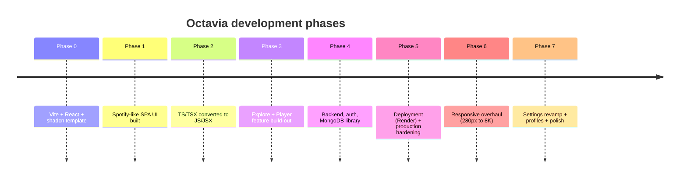

# Changelog

> **What you'll learn here:** the evolution of Octavia inferred from its Git history, plus a template for recording future changes. This isn't a marketing release log — it's a developer's map of how the project got to its current shape and why.

This document follows the spirit of [Keep a Changelog](https://keepachangelog.com/) and [Semantic Versioning](https://semver.org/). Because the project has not been formally version-tagged, the versions below are **inferred phases** reconstructed from commit history (`git log`), grouped into meaningful milestones rather than literal release tags.

---

## How the project evolved (at a glance)



---

## [Unreleased]

Changes on the current working branch that haven't been grouped into a milestone yet. Add new entries here as you work.

### Added
- Comprehensive `docs/` documentation set (this folder).
- `src/index.css` (untracked at time of writing) — see [styling-guide.md](./styling-guide.md).

### Known issues
- See [known-issues.md](./known-issues.md) (Explore test harness, placeholder forgot-password, fake visualizer, etc.).

---

## Phase 7 — Settings, profiles & responsive polish *(most recent work)*

The latest and largest body of recent commits. Focused on user-facing preferences, profile identity, and pixel-level UI correctness across devices.

### Added
- **World-class Settings**: theme picker, accent-color picker, and text-size control, applied globally and persisted per-user on the server (`9608d74`, `7180804`, `9011ca0`).
- **Profile photo upload** with in-browser crop & zoom (`664f8f1`).
- **Glass segmented quick-nav rail** in Settings (`9011ca0`).
- Spinning now-playing **vinyl disc** on small screens (`f8564be`).
- **Background audio** continuity + polished media (lock-screen) notification (`eaf7353`).
- Shareable **playlists** (`e363928`).

### Changed
- Settings now persist correctly and sync per-user account (`40df9f8`).
- Recently-played capped at 20 songs, evicting oldest from MongoDB (`5d69dcf`).
- Player transport layout reworked to be reachable/centered on phones (`31d07c2`, `7b25256`, `04828f3`).

### Fixed
- Play/pause button stuck on the pause icon when audio was paused (`64562e9`).
- Album likes not saving; liked albums now playable from library (`20a1fea`).
- Playlist creation not syncing (`e363928`).
- Numerous touch-target / breakpoint bugs (toggles, drawers, headers, mini-player) (`a8db772`, `b5bbf5c`, `9165e9b`, `a55efc2`).

---

## Phase 6 — Responsive overhaul

A dedicated pass to make the UI adapt cleanly from **280px phones to 8K displays**, introducing the fluid breakpoint ladder and spacing tokens documented in [styling-guide.md](./styling-guide.md).

### Added
- Fluid breakpoints, spacing tokens, and responsive image sourcing (`9319258`).

### Fixed
- Page-level horizontal scrollbar and card "shearing" (`0d39ba0`).
- Sidebar gap on large screens; `--sidebar-w` aligned to actual widths (`40ad2db`).
- Charts filters / player / sidebar / home responsiveness (`44a3539`).

### Performance
- Disabled `backdrop-filter` and grain overlay **during scroll** to eliminate jank (`2a05319`, `6ff7b30`, `795eb62`).
- App-wide UI lag reduced via render optimizations (`d036850`).
- Smooth page scrolling; fixed nested side-scroll (`00d171a`).

---

## Phase 5 — Deployment & production hardening

Getting the app to run reliably in production (Render), with the cross-site auth and bundling fixes that production exposed.

### Added
- **Render blueprint** with SPA rewrite for the frontend (`01759b7`).
- Per-user **database-backed search history** (`65a393c`).

### Fixed
- Production startup crash from player chunk splitting; removed custom manual chunking (`8513d05`, `bd84107`).
- App shell guarded against `FooterPlayer` runtime crashes (`c545c2e`).
- **Cross-site auth**: `SameSite=None` cookies in production (`e48fb56`), CSRF 403 on logged-in library writes (`ad12693`), registration 500/`500` async pre-save hook bug (`9b5a503`).
- `400` on library writes by stripping client-only display fields in validators (`1aa5f38`).

### Security
- Enforced **per-user library isolation** and login-required saves (`3c5c809`).

---

## Phase 4 — Backend, authentication & MongoDB library

The project gained a real backend: an Express API, MongoDB persistence, and JWT auth. This is when "library" features (favorites, playlists, liked albums, followed artists, history) became server-backed and per-user.

### Added
- Express REST API (`server/`), MongoDB via Mongoose, JWT auth with refresh-token rotation. See [architecture.md](./architecture.md), [authentication.md](./authentication.md), [database.md](./database.md).
- User registration/login and protected library endpoints.

---

## Phase 3 — Explore & Player feature build-out

Heavy iteration on the two signature experiences: the discovery/Explore surface and the Now-Playing player.

### Added / Changed
- Explore section features and bug fixes (`eb59af7`, `9ad86c2`).
- Player section updates across several commits (`8fdb029`, `5a7af3f`, `20d24bd`).
- Search UX and Home UI/UX changes (`e1c2c17`).
- Component-wide fixes and folder-structure reorganization (`d446fda`, `c717e93`).

---

## Phase 2 — JavaScript conversion

A deliberate migration **away from TypeScript** for application code: TS/TSX files were converted to JS/JSX (`efaf2e0`, `dbd17a0`). A few config files (`vite.config.ts`, `tailwind.config.ts`, `tsconfig.json`) remain TypeScript. This is why you'll see `.jsx` app code but `.ts` configs — see [folder-structure.md](./folder-structure.md).

---

## Phase 1 — Spotify-like SPA UI

The first real product work: building a Spotify-inspired single-page UI on top of the template (`2b8a811`).

---

## Phase 0 — Project scaffold

Bootstrapped from a **Vite + React + shadcn/ui (TypeScript)** starter template (`bebc3a2`). This is the origin of the frontend `package.json` name `vite_react_shadcn_ts`.

---

## Template for future entries

When you make a change, add it under `[Unreleased]` using these categories (omit empty ones):

```markdown
## [Unreleased]

### Added
- New features.

### Changed
- Changes to existing behavior.

### Deprecated
- Soon-to-be-removed features.

### Removed
- Removed features.

### Fixed
- Bug fixes.

### Security
- Vulnerability fixes / auth/permission changes.
```

When you cut a release, replace `[Unreleased]` with a version + date heading, e.g.:

```markdown
## [1.0.0] - 2026-07-01
```

### Versioning guidance (SemVer)
- **MAJOR** (`x.0.0`): breaking API/behavior changes (e.g. changing an endpoint's response shape, removing a route).
- **MINOR** (`0.x.0`): backward-compatible new features (new page, new endpoint, new setting).
- **PATCH** (`0.0.x`): backward-compatible bug fixes and polish.

---

## Key things to remember

- **Versions here are inferred phases**, not formal Git tags — treat them as a narrative, not a contract.
- The big architectural turning point was **Phase 4** (adding the backend + auth + MongoDB); everything before it was a frontend-only SPA.
- **Phase 2's TS→JS conversion** explains the mixed `.jsx`/`.ts` file extensions you'll see today.
- Keep new work logged under **`[Unreleased]`** so this file stays useful for the next developer.
