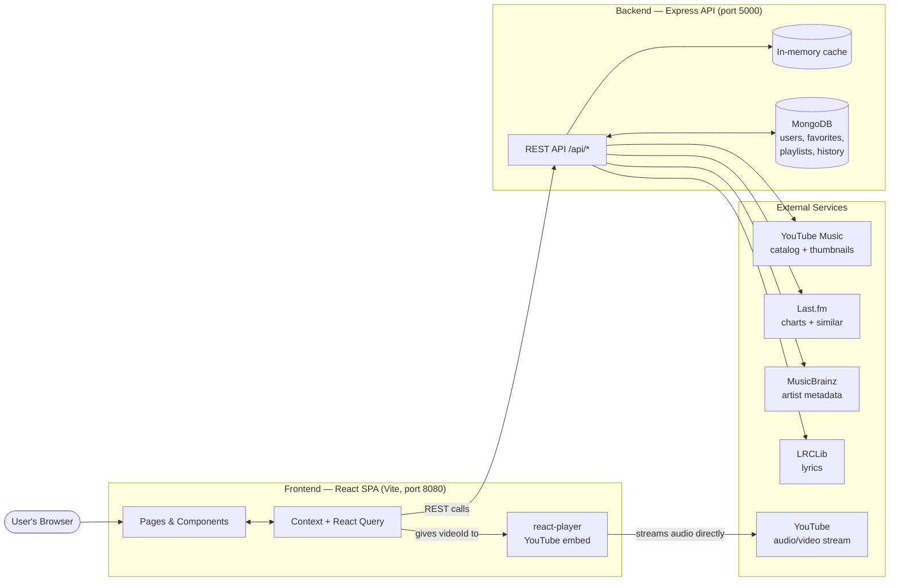

# Octavia — Developer Documentation

> **What you'll learn here:** what Octavia is, how the whole system fits together, and exactly where to go next to get productive. This is the front door to the docs. Read this first.

---

## What is Octavia?

Octavia is a **modern music streaming and discovery web app**. You can search for songs, play them instantly, browse live charts and trending tracks, build playlists and favorites, and explore personalized recommendations — all wrapped in a polished, magazine-style interface.

In one sentence: **Octavia is a Spotify-like music player that streams audio straight from YouTube in your browser, while a small backend serves the catalog metadata, charts, lyrics, and your personal library.**

## What problem does it solve?

Building a music app normally requires expensive licensing deals with a music catalog provider. Octavia sidesteps that by:

- **Playing audio directly from YouTube** in the browser (via an embedded player) — so there are no streaming/licensing costs and no audio passes through Octavia's own servers.
- **Pulling metadata from free/open sources** — YouTube Music (catalog + thumbnails), Last.fm (charts + similar tracks), MusicBrainz (artist country, release dates), and LRCLib (lyrics).
- **Storing only the user's own data** (account, favorites, playlists, settings) in its own database.

The result is a full-featured music experience that an independent developer can run without a record-label contract.

## Most important technologies

| Area | Technology |
|------|------------|
| Frontend framework | **React 18** + **Vite** (build tool) |
| Styling | **Tailwind CSS** + **shadcn/ui** (Radix primitives) + a custom design-token system |
| Server state / caching | **TanStack Query** (React Query) |
| Client state | **React Context** (auth, player, settings, library) |
| Routing | **react-router-dom v6** |
| Audio playback | **react-player** (YouTube source) |
| Backend | **Node.js** + **Express** |
| Database | **MongoDB** (via **Mongoose**) |
| Auth | **JWT** access/refresh tokens in **HttpOnly cookies** + CSRF |
| External data | YouTube Music (`ytmusic-api`), Last.fm, MusicBrainz, LRCLib |

See [`tech-stack.md`](./tech-stack.md) for the complete list with explanations.

---

## High-level system overview

Octavia has three big pieces: the **browser app**, the **Octavia backend**, and the **external data/streaming sources**.



The key insight to remember: **metadata flows through the backend, but the actual audio never does.** The backend hands the browser a YouTube `videoId`, and the browser streams the audio straight from YouTube.

---

## How to read these docs

These docs are written so a brand-new developer can understand the whole project in a few hours. Read them in this recommended order:

### Phase 1 — Understand what it is (≈ 15 min)
1. **[README.md](./README.md)** ← you are here.
2. **[architecture.md](./architecture.md)** — the big picture of how the system is designed.

### Phase 2 — Get it running (≈ 30 min)
3. **[getting-started.md](./getting-started.md)** — clone, install, configure, and run locally.
4. **[environment-variables.md](./environment-variables.md)** — every env var explained.

### Phase 3 — Learn the layout (≈ 30 min)
5. **[folder-structure.md](./folder-structure.md)** — every folder and file explained.
6. **[tech-stack.md](./tech-stack.md)** — every library and why it's used.

### Phase 4 — Understand the moving parts (≈ 1 hr)
7. **[state-management.md](./state-management.md)** — how state lives in Context vs React Query.
8. **[data-flow.md](./data-flow.md)** — how data travels end to end.
9. **[styling-guide.md](./styling-guide.md)** — the design-token + theming system.
10. **[authentication.md](./authentication.md)** — login, tokens, cookies, CSRF.
11. **[database.md](./database.md)** — the MongoDB schema.

### Phase 5 — Reference (as needed)
12. **[pages/](./pages/)** — one document per route/page.
13. **[components/](./components/)** — component reference, grouped by area.
14. **[api/](./api/)** — one document per API area (endpoints + services).
15. **[third-party-services.md](./third-party-services.md)** — external integrations.
16. **[known-issues.md](./known-issues.md)** — current bugs, limitations, and tech debt.
17. **[glossary.md](./glossary.md)** — definitions of project-specific terms.
18. **[CHANGELOG.md](./CHANGELOG.md)** — history and versioning.

### Complementary deep-dives (pre-existing docs)
These older reference docs still apply and go deeper on a few topics:
- [`frontend-guide.md`](./frontend-guide.md) — frontend conventions.
- [`backend-guide.md`](./backend-guide.md) — backend internals.
- [`api-reference.md`](./api-reference.md) — condensed API contract.
- [`data-models-and-config.md`](./data-models-and-config.md) — models + config.
- [`testing-and-quality.md`](./testing-and-quality.md) — test strategy.
- [`troubleshooting.md`](./troubleshooting.md) — common runtime problems.
- [`contributing.md`](./contributing.md) — contribution workflow.

---

## Repository at a glance

This is a **monorepo** with two apps in one Git repository:

```
harmony-hub/
├── src/              # Frontend: React single-page app (Vite)
├── server/           # Backend: Express REST API + MongoDB
├── public/           # Static assets (favicons, placeholders, og-image)
├── docs/             # ← You are here
├── index.html        # Frontend HTML entry
├── package.json      # Frontend dependencies & scripts
└── server/package.json  # Backend dependencies & scripts
```

> **Naming note:** the Git folder is `harmony-hub` and the frontend `package.json` is still named `vite_react_shadcn_ts` (the original scaffold name), but the product is called **Octavia** everywhere user-facing. Don't let the folder name confuse you — it's the same project.

---

## Key things to remember

- **Audio is never proxied.** The backend only returns metadata + a YouTube `videoId`; the browser streams audio directly from YouTube via `react-player`.
- **Two state systems.** Server/catalog data lives in **React Query**; session/UI/playback state lives in **React Context**. See [state-management.md](./state-management.md).
- **The backend works without a database for music browsing.** Search, charts, trending, etc. are public and don't need MongoDB. Only auth + personal library routes require the database.
- **Most page files are thin.** Routes in `src/app/App.jsx` point at `src/features/*/pages/`, which usually re-export the real implementation from `src/pages/`. See [folder-structure.md](./folder-structure.md).
- **The product name is Octavia**, regardless of repo/package names.
