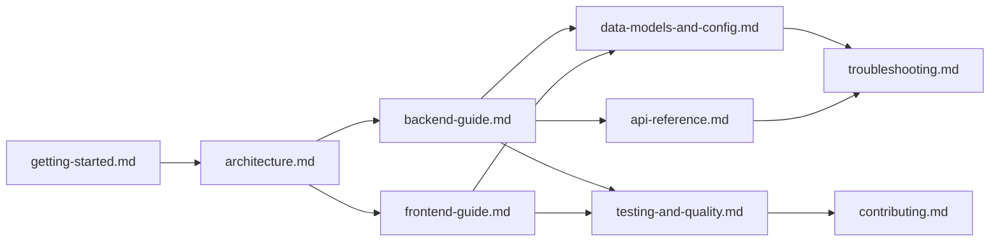

# Octavia Documentation

This `docs/` directory is the project reference for contributors and maintainers.
It is organized for two workflows:

- fast onboarding (run the app, understand major moving parts),
- deep implementation work (routes, data contracts, testing, and operations).

## Read In This Order

1. [Getting Started](./getting-started.md)
2. [Architecture](./architecture.md)
3. [Frontend Guide](./frontend-guide.md)
4. [Backend Guide](./backend-guide.md)
5. [API Reference](./api-reference.md)
6. [Data Models and Config](./data-models-and-config.md)
7. [Testing and Quality](./testing-and-quality.md)
8. [Troubleshooting](./troubleshooting.md)
9. [Contributing](./contributing.md)

## Documentation Map

## Source-Of-Truth Files Behind These Docs

- Project overview and quick commands: `README.md`
- Backend behavior and API notes: `backend-setup.md`
- Environment variables: `.env.example`
- Frontend scripts: `package.json`
- Backend scripts: `server/package.json`
- Frontend routes: `src/app/App.jsx`
- Backend route registration: `server/src/routes/index.js`
- Quality baselines: `UX_VALIDATION.md`, `RESPONSIVE_QA_MATRIX.md`

## Scope Notes

- The app is a Vite + React frontend at repository root.
- The backend is an Express server in `server/`.
- Playback streams directly from YouTube in the browser (`react-player`), while
  backend APIs serve metadata and discovery data.
