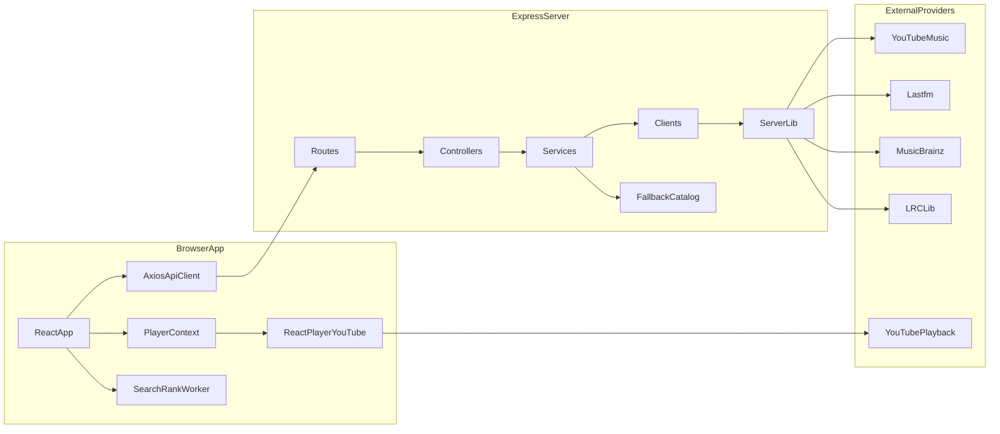
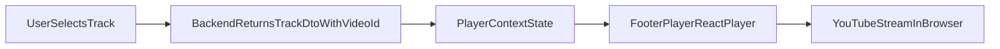

# Architecture

This document explains how Octavia is split, how requests flow, and how the
system maintains UX quality when upstream providers are slow or unavailable.

## System Overview

Octavia has two runtime applications:

- **Frontend (`src/`)**: React SPA (Vite) that renders all pages and playback UI.
- **Backend (`server/`)**: Express API that aggregates catalog/discovery/lyrics
  data from external services.

Core boundary:

- Metadata and discovery come from backend API endpoints (`/api/...`).
- Actual media streaming is **not** proxied by backend; the browser plays
  YouTube directly via `react-player`.

## High-Level Architecture

## Frontend Runtime Model

Entry sequence:

1. `index.html`
2. `src/main.jsx`
3. `src/app/main.jsx`
4. `src/app/App.jsx`

App-level providers are assembled in `src/app/providers.jsx`:

- `QueryClientProvider` for server-state fetching/caching
- context providers for player, favorites, playlists, settings, notifications,
  followed artists, liked albums, UI, and sound

Route tree is defined in `src/app/App.jsx` and lazy-loads feature pages under
`src/features/*/pages/*` (which often re-export from `src/pages/*`).

## Backend Runtime Model

Startup:

- `server/index.js` creates app via `server/src/app.js` and listens on `PORT`
  (default `5000`).
- On startup (unless disabled), it warms up YouTube Music integration and primes
  charts/trending caches.

Request pipeline:

1. route file (`server/src/routes/*.routes.js`)
2. controller (`server/src/controllers/*.controller.js`)
3. service (`server/src/services/*.service.js`)
4. clients (`server/src/clients/*.client.js`)
5. integration libraries (`server/lib/*.js`)

This layering keeps HTTP concerns in controllers and provider-specific logic in
`server/lib`.

## Data Flow By Concern

### Search / Detail / Home

- Frontend calls backend endpoint through `src/lib/api.js`.
- Service attempts a live provider call first.
- If live result fails or is empty, `liveOrFallback(...)` can return static
  catalog data (`server/src/data/catalog.js`) to keep the UI functional.

### Charts

Charts pipeline combines:

- Last.fm: ranking, listener/play metrics, genre signals
- MusicBrainz: artist country + release date enrichment
- YouTube Music: playable `videoId`, thumbnails, durations

If Last.fm-based pipeline fails, a YouTube Music fallback payload can still be
returned so charts remain available with reduced metadata richness.

### Explore

Explore endpoints (`/api/explore/...`) are served via `server/lib/explore-service.js`
using a mix of:

- chart data
- YTM searches/trending
- Last.fm similar-track lookups

### Lyrics

Lyrics endpoint (`/api/lyrics`) uses `server/lib/lyrics.js`:

- strict LRCLib lookup first
- relaxed fallback search variants
- optional YouTube oEmbed metadata extraction when only `videoId` is known

## Playback Flow (Important Boundary)

Backend responsibility ends at delivering metadata (`videoId`, title, artist,
thumbnail, etc.). It does not stream audio/video.

## Caching And Resilience Strategy

Caching exists on multiple levels:

- frontend query caching: React Query defaults + query-key factory
- backend route responses: HTTP cache headers (`Cache-Control`)
- backend integration caches: in-memory TTL and in-flight dedupe in libraries
  (`ytmusic`, `charts-service`, `explore-service`, `lyrics`, `lastfm`, `musicbrainz`)

Resilience rules:

- route-level fallbacks return useful data instead of blank responses
- stale-cache-with-refresh behavior for charts when data is old
- bounded in-memory caches to avoid unbounded process growth

## Architecture Constraints

- no server-side media proxy (client-side playback only)
- no persistent server database (runtime cache + static fallback catalog)
- single backend process model (no separate worker service)
- external API reliability directly affects freshness, but fallback logic
  protects baseline UX

## Where To Go Next

- [Frontend Guide](./frontend-guide.md)
- [Backend Guide](./backend-guide.md)
- [API Reference](./api-reference.md)
- [Data Models and Config](./data-models-and-config.md)
