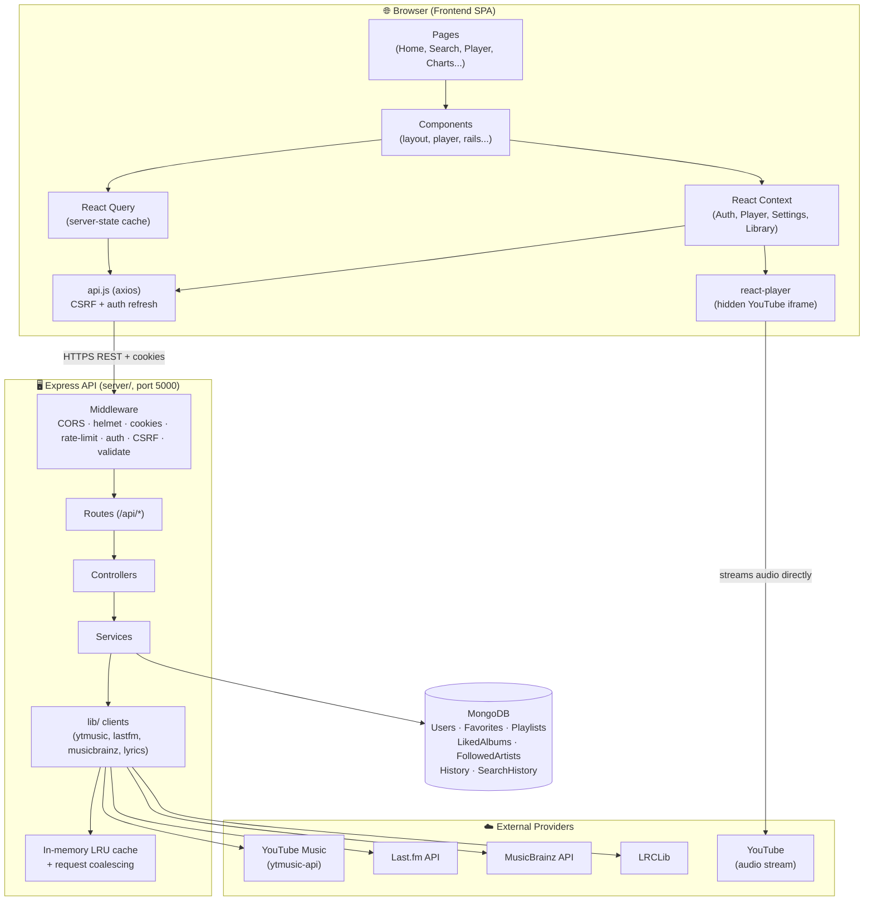
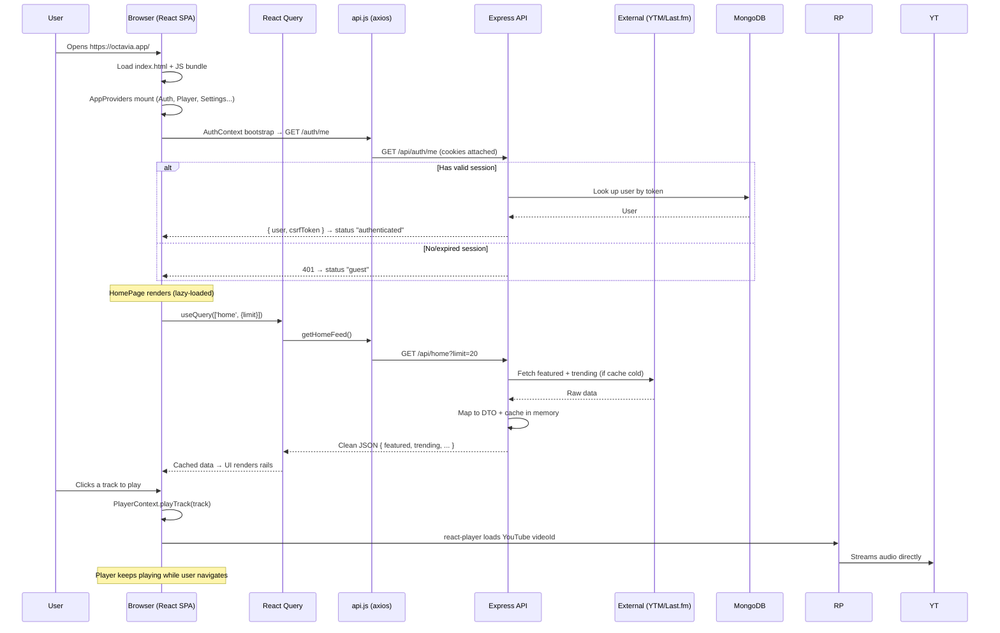

# Architecture

> **What you'll learn here:** the overall design pattern, a full diagram of how the frontend, backend, database, and external services connect, what each layer is responsible for, the complete request lifecycle from app open to data on screen, and the *why* behind the big technical decisions.

---

## Summary

Octavia is a **client–server web application** split into:

- A **component-based React single-page application (SPA)** that runs entirely in the browser.
- A **layered (MVC-style) Express REST API** that serves catalog metadata, charts, lyrics, and the user's personal library.
- A **MongoDB database** that stores only user-owned data (accounts, favorites, playlists, history, settings).
- A set of **external data providers** (YouTube Music, Last.fm, MusicBrainz, LRCLib) and **YouTube itself** for audio playback.

It is **not** microservices and **not** serverless — it's two cooperating monolithic apps (one SPA, one API server) in a single repository.

---

## 1. The architecture pattern

### Frontend: component-based SPA
The frontend is a **Single-Page Application**. The browser loads one HTML file (`index.html`) and a JavaScript bundle, and from then on React swaps the page contents in place when you navigate — no full page reloads. The UI is built from **composable components** (small, reusable building blocks) organized by feature.

*Why this pattern?* Music apps need instant, fluid navigation (the player must keep playing while you browse). An SPA keeps the audio element mounted and avoids reloads, which is exactly what a streaming app needs.

### Backend: layered (MVC-like) REST API
The backend follows a **layered architecture**, a close cousin of MVC:

```
Route → Controller → Service → Client/Library → External API or Database
```

- **Routes** declare URLs and attach middleware (auth, validation, rate limits).
- **Controllers** translate HTTP requests/responses (the "C" in MVC).
- **Services** hold business logic.
- **Clients/Libraries** talk to external APIs and the database (the "M").
- The **frontend is the "V"** (view) — there are no server-rendered HTML views.

*Why this pattern?* Each layer has one job, so the code is easy to test and change. For example, you can swap the chart data source (Last.fm → something else) by editing one library file without touching routes or controllers.

### Overall: a monorepo of two cooperating monoliths
Both apps live in one Git repo but run as separate processes. This keeps deployment simple (no service mesh, no orchestration) while still separating concerns cleanly.

---

## 2. Full architecture diagram



**The most important arrow:** `react-player → YouTube`. Audio bytes flow directly from YouTube to the browser. The Octavia server is never in the audio path — it only tells the browser *which* `videoId` to play.

---

## 3. Each layer explained

### The frontend handles
- **Rendering the UI** — every screen, animation, and interaction.
- **Client state** — what's playing, the queue, volume, theme, open dialogs (React Context).
- **Server-state caching** — fetched catalog data, deduped and cached (React Query).
- **Playback** — embedding YouTube and controlling play/pause/seek (`react-player`).
- **Routing** — mapping URLs to pages and guarding protected routes.
- **Optimistic updates** — when you favorite a track, the UI updates instantly and reconciles with the server in the background.

### The backend handles
- **Aggregating external data** — combining YouTube Music + Last.fm + MusicBrainz into a single clean response shape (a DTO) the frontend can render directly.
- **Caching + coalescing** — external APIs are slow and rate-limited, so the server caches responses in memory and collapses concurrent identical requests into one upstream call.
- **Authentication** — registering/logging in users, issuing JWTs, managing sessions.
- **Personal library** — CRUD for favorites, playlists, liked albums, followed artists, listening/search history, and settings.
- **Authorization** — protecting `/me/*` (logged-in users) and `/admin/*` (admins only).
- **Resilience** — falling back to a built-in static catalog when a live source fails, so the UI never goes blank.

### The database stores
Only **user-owned data**. Catalog data (songs, albums, artists) is **never** stored — it's fetched live and cached in memory. The collections are:

| Collection | Stores |
|------------|--------|
| `users` | Account, password hash, role, settings, refresh-token hashes |
| `favorites` | Liked tracks (with a snapshot of track metadata) |
| `likedalbums` | Saved albums |
| `followedartists` | Followed artists |
| `playlists` | User playlists (track snapshots embedded) |
| `listeninghistories` | Recently played (capped at 20) |
| `searchhistories` | Recent searches (capped at 50) |

See [database.md](./database.md) for full schemas.

---

## 4. The request lifecycle

Here's what happens from the moment a user opens the app to seeing playable music on screen.



**Step by step in words:**

1. **Boot.** The browser downloads `index.html` and the JS bundle. React mounts and wraps the app in a stack of Context providers (`src/app/providers.jsx`).
2. **Auth check.** `AuthContext` immediately calls `GET /api/auth/me`. If cookies contain a valid session, the user is "authenticated"; otherwise "guest". If the access token is expired, axios automatically tries `POST /api/auth/refresh` once.
3. **Route render.** react-router matches the URL and lazy-loads the matching page component (code-splitting keeps the initial bundle small).
4. **Data fetch.** The page uses React Query hooks (e.g. `getHomeFeed()`), which call the backend through `api.js` (axios).
5. **Backend work.** Express runs the request through middleware (CORS, auth, rate-limit, validation), then the controller → service → external client. The first request after a cold cache hits the live source; subsequent ones are served from the in-memory cache.
6. **Render.** React Query caches the response and the page renders. While playback happens, the audio streams directly from YouTube and persists across navigation because the player lives in the always-mounted layout, not in any page.

---

## 5. Important architectural decisions (and why)

### Why React + Vite (not Next.js / CRA)?
The app is a **pure SPA** with no need for server-side rendering of dynamic content (audio playback is client-only anyway). **Vite** gives near-instant dev startup and HMR, and a fast Rollup production build. This keeps the developer feedback loop tight.

### Why stream audio from YouTube directly?
Licensing a music catalog is prohibitively expensive. YouTube already hosts the audio/video and allows embedded playback. By handing the browser a `videoId` and letting `react-player` stream directly, Octavia gets a huge catalog with **zero streaming cost** and **no bandwidth on Octavia's servers**.

### Why a separate Express backend (not call APIs from the browser)?
Three reasons:
1. **Secrets stay server-side** — the Last.fm API key never reaches the browser.
2. **Aggregation + shaping** — the backend merges several messy upstream shapes into one clean DTO, so the frontend doesn't juggle four APIs.
3. **Caching + rate-limit protection** — upstream APIs are slow and rate-limited; the server caches and coalesces requests to stay fast and avoid bans.

### Why MongoDB (document database)?
User library data (playlists with embedded track snapshots, flexible settings objects) is naturally **document-shaped**. Embedding a track snapshot inside a playlist avoids joins and means a playlist still renders even if the live catalog is unreachable. Mongoose adds schema validation on top.

### Why React Query for server state + Context for client state?
- **React Query** specializes in fetching, caching, deduping, and revalidating *server* data. Using it removes a ton of manual loading/error/cache boilerplate.
- **React Context** is perfect for *client* state that many components read (current track, theme, auth). Mixing the two — Context as a friendly facade over React Query for library data — gives both ergonomics and a robust cache.

See [state-management.md](./state-management.md) for the full split.

### Why JWT-in-cookies + CSRF (not localStorage tokens)?
Storing tokens in **HttpOnly cookies** means JavaScript (and therefore XSS attacks) can't read them. The trade-off is CSRF risk, which Octavia mitigates with a **double-submit CSRF token**. Because the frontend and API can live on different subdomains (where the CSRF cookie isn't readable by JS), the CSRF token is also returned in auth response bodies and echoed back in a header. See [authentication.md](./authentication.md).

### Why an in-memory cache (not Redis)?
The catalog data is non-critical and identical for all users, so a simple per-process LRU cache with TTLs is enough and adds **zero infrastructure**. The trade-off (cache isn't shared across multiple server instances) is acceptable because a cold cache just means one slightly slower request. Request **coalescing** ensures a thundering herd on a cold key still results in a single upstream call.

### Why a static fallback catalog?
External providers occasionally fail or rate-limit. A built-in static catalog (`server/data/catalog.js`) lets search/detail/charts degrade gracefully instead of showing an empty screen.

---

## 6. Cross-cutting concerns

| Concern | How it's handled |
|---------|------------------|
| **Performance** | Route-level code splitting (`React.lazy`), route prefetching on hover, React Query caching, in-memory backend cache + coalescing, pre-compressed gzip/brotli assets, split player-progress context to avoid re-renders. |
| **Accessibility** | `prefers-reduced-motion` + user "reduce motion" setting, ARIA live regions (`PlayerAnnouncer`), keyboard navigation + shortcuts, focus-visible ring system, 44px touch targets. |
| **Resilience** | Static catalog fallback, error boundaries, React Query retries, graceful empty/error states per page. |
| **Security** | Helmet headers, CORS allowlist, rate limiting per route family, JWT rotation + reuse detection, bcrypt password hashing, Zod input validation, CSRF protection. |
| **SEO/meta** | `react-helmet-async` (`RouteHead`) sets per-route titles + OG tags; structured data in `index.html`. |

---

## Key things to remember

- The system is **three tiers**: React SPA → Express API → (MongoDB + external providers). Audio is a **fourth, separate path** straight from YouTube to the browser.
- The backend is **layered MVC-style**: Route → Controller → Service → Client/Lib.
- **Catalog data is fetched + cached, never persisted.** Only user-owned data is in MongoDB.
- The biggest cost-saving decision is **direct YouTube streaming** — internalize this, because it explains a lot of the app's design (e.g., the player is a hidden YouTube iframe, the visualizer is fake because the audio can't be tapped, thumbnails come from `ytimg.com`).
- Most major decisions trade infrastructure simplicity for a small amount of resilience complexity (in-memory cache + fallback catalog).
