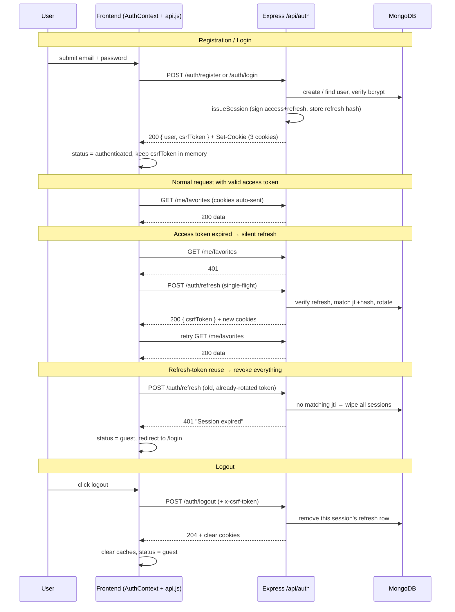

# Authentication

> **What you'll learn here:** the complete auth system — what type of auth is used, how sign-up/sign-in work step by step, how the app keeps you logged in, how protected routes work, how logout works, and the full flow as a diagram. Source files: `server/src/services/auth.service.js`, `server/src/utils/auth.js`, `server/src/middleware/auth.js`, `src/contexts/AuthContext.jsx`, `src/lib/api.js`.

---

## Summary

Octavia uses **email + password** auth with **JWT (JSON Web Token) sessions stored in HttpOnly cookies**, plus a **CSRF token** to protect mutating requests. There are two tokens:

- A short-lived **access token** (default 15 minutes) — proves who you are on each request.
- A long-lived **refresh token** (default 30 days) — used to silently get a new access token so you stay logged in.

Refresh tokens are **rotated** on every use and have **reuse detection** (if an old refresh token is replayed, all your sessions are revoked). This is a modern, secure session design.

---

## Why this approach

- **HttpOnly cookies** mean JavaScript can't read the tokens, so an XSS attack can't steal them (unlike `localStorage`).
- The trade-off of cookies is **CSRF** risk, mitigated with a **double-submit CSRF token**.
- **Token rotation + reuse detection** limits the damage if a refresh token ever leaks.
- **bcrypt** (cost ≥ 12) makes stored passwords expensive to crack.

---

## The tokens and where they live

| Token | Lifetime (default) | Cookie | `HttpOnly`? | Cookie `Path` | Purpose |
|-------|--------------------|--------|-------------|---------------|---------|
| Access | `JWT_ACCESS_TTL` = 15m | `accessToken` | Yes | `/` | Authenticate each API request |
| Refresh | `JWT_REFRESH_TTL` = 30d | `refreshToken` | Yes | `/api/auth` | Mint new access tokens silently |
| CSRF | matches refresh TTL | `csrfToken` | **No** (JS-readable) | `/` | Echoed back in a header on writes |

**Cookie flags** (`server/src/utils/auth.js`, `buildAuthCookieOptions`):
- `secure` = `COOKIE_SECURE` (true in production; set `false` for local http).
- `sameSite` = `COOKIE_SAMESITE`, or auto: `none` when secure (needed when frontend + API are on different sites), else `lax`. (`none` is downgraded to `lax` if not secure, since browsers reject insecure `SameSite=None`.)
- `domain` = `COOKIE_DOMAIN` if set.
- The refresh cookie's `Path` is scoped to `/api/auth` so it's only sent to auth endpoints.

**JWT payloads:**
- Access: `{ sub: userId, role, jti }` signed with `JWT_ACCESS_SECRET`.
- Refresh: `{ sub: userId, jti }` signed with `JWT_REFRESH_SECRET`.

`jti` is a unique id per token (a UUID). For refresh tokens, the server stores a **SHA-256 hash** of the token (not the token itself) in the user's `refreshTokenHashes` array, keyed by `jti`. One array entry = one active session/device.

---

## The CSRF token (important + slightly unusual)

Because the frontend and API can be deployed on **different subdomains** (e.g. separate `*.onrender.com` hosts, which are cross-site), the browser won't let frontend JS read the API's `csrfToken` cookie. So Octavia uses a belt-and-braces approach:

1. The CSRF token is returned **in the JSON body** of `register`, `login`, `refresh`, and `me` responses.
2. The frontend keeps it **in memory** (`setCsrfToken` in `src/lib/api.js`).
3. On every **mutating** request (POST/PATCH/PUT/DELETE), axios attaches it as the `x-csrf-token` header.
4. The backend's `requireCsrf` middleware checks it — **but only when the request used cookie auth** (i.e. an `accessToken`/`refreshToken` cookie is present). Pure Bearer-token clients skip CSRF (they're not vulnerable to it).
5. On the same-site case, the token is *also* in the `csrfToken` cookie, so the classic double-submit check (`cookie === header`) works.

---

## How a user signs up

`POST /api/auth/register` → `auth.controller.register` → `auth.service.register`.

1. The request body is validated by Zod (`registerSchema`): `email`, `username`, `password` (8–128 chars), optional `displayName`.
2. The service normalizes email/username and checks neither is already taken → `409 Conflict` if so.
3. It creates the `User`. The password is hashed by bcrypt in the model's `pre('save')` hook (cost = `BCRYPT_ROUNDS`, min 12).
4. `issueSession` runs: it signs an access + refresh token (each with a fresh `jti`), stores the **hash** of the refresh token in `refreshTokenHashes`, sets `lastLoginAt`, and saves.
5. The controller sets the three cookies and returns `201 { user, csrfToken }`.
6. On the frontend, `AuthContext.register` stores the CSRF token and sets `status = authenticated`.

Registration is rate-limited to **5 attempts per minute** per IP.

## How a user logs in

`POST /api/auth/login` → `auth.service.login`.

1. Zod validates `email` + `password`.
2. The service finds the user by (normalized) email and calls `comparePassword` (bcrypt). On any failure it throws a generic `Invalid credentials` (so you can't tell whether the email exists).
3. `issueSession` issues tokens + cookies exactly as in registration.
4. Returns `200 { user, csrfToken }`.

Login is rate-limited to **10 attempts per minute**, keyed by IP + email.

---

## How you stay logged in (refresh + rotation)

This is the heart of the session model.

When the **access token expires** (after ~15 min), the next API call gets a `401`. The frontend's axios interceptor (`src/lib/api.js`) catches it and **transparently** calls `POST /api/auth/refresh` once, then retries the original request. A single-flight queue ensures that if many requests fail at once, only **one** refresh happens.

On the server, `auth.service.refresh`:
1. Verifies the refresh token's signature.
2. Looks up the user and finds the matching `refreshTokenHashes` row by `jti`.
3. **Reuse detection:** if no row matches that `jti`, the token was already used (rotated away) or forged → **all sessions are revoked** (`refreshTokenHashes = []`) and it throws "Session expired".
4. Compares the presented token's hash against the stored hash using a **timing-safe** comparison. Mismatch → revoke all + error.
5. **Rotation:** removes the old row and issues a brand-new session (new access + refresh tokens, new `jti`s).

So every refresh "burns" the old refresh token and mints a new one. A stolen old token is useless and triggers a full logout — the leak is self-limiting.

Expired refresh-token rows are pruned automatically on each session operation.

---

## How protected routes work

### On the backend
Middleware in `server/src/middleware/auth.js`:
- **`requireAuth`** — reads the access token from the `Authorization: Bearer` header *or* the `accessToken` cookie, verifies it, loads the user (a lean query that omits the heavy `avatarUrl`), and attaches `req.user`. No/invalid token → `401`.
- **`requireRole(role)`** — after `requireAuth`, checks `req.user.role === role`; otherwise `403`. Used for `/admin`.
- **`requireOwnership(Model, opts)`** — confirms the resource belongs to `req.user` (used for playlist edits, matching `playlistId` + `userId`); otherwise `404`.
- **`requireCsrf`** — the CSRF check described above.
- **`requireDatabaseConnection`** (`db-ready.js`) — returns `503` if MongoDB isn't connected, applied to all `/auth/*` and `/me/*` routes.

Route protection summary:

| Scope | Requirements |
|-------|--------------|
| Public catalog (`/search`, `/charts`, `/album/:id`, ...) | none (rate-limited) |
| `/auth/*` mutations (logout, change-password) | `requireAuth` + `requireCsrf` |
| `/me/*` (favorites, playlists, settings, history) | DB + `requireAuth` (+ `requireCsrf` on writes) |
| `/users/me` | DB + `requireAuth` + `requireCsrf` |
| `/admin/*` | DB + `requireAuth` + `requireRole('admin')` |

### On the frontend
Route guards in `src/components/auth/`:
- **`ProtectedRoute`** — while `AuthContext.status === 'loading'`, shows a spinner; if there's no user, redirects to `/login?redirect=<current path>`; otherwise renders the page. Wraps `/favorites`, `/library`, `/playlist/:id`, `/settings`, `/account`.
- **`RoleRoute role="admin"`** — wraps `ProtectedRoute` and additionally redirects non-admins to `/`. Wraps `/admin`.

The `?redirect=` param means after you log in, you're sent back to where you were trying to go.

---

## How a user logs out

- **`POST /api/auth/logout`** — `auth.service.logout` removes the **current session's** refresh-token row (matched by `jti` decoded from the refresh cookie), so other devices stay logged in. Cookies are cleared. Returns `204`.
- **`POST /api/auth/logout-all`** — clears the entire `refreshTokenHashes` array, logging out **every** device. Returns `204`.
- **Change password** also clears all sessions (you must log in again everywhere) and clears cookies.

On the frontend, `AuthContext.logout` calls the API (best-effort), clears the in-memory CSRF token, removes all `['me', ...]` React Query caches and legacy `localStorage` keys, and sets `status = guest`.

---

## The complete auth journey (diagram)

---

## App-boot auth check

On every page load, `AuthContext` runs `bootstrap()`:
1. Wire axios interceptors (`configureApiAuth`).
2. `GET /auth/me`. If `200`, you're authenticated (and a CSRF token is returned, re-issued if the cookie was missing).
3. If `401`, try `POST /auth/refresh` once, then re-fetch `/auth/me`.
4. Any remaining failure → `status = guest`.

This is why a returning user with a valid refresh cookie is silently logged back in.

---

## Admin accounts

- Admin = a `User` whose `role` is `'admin'`.
- Bootstrap one with the seed script: `npm --prefix server run seed:admin` using `ADMIN_BOOTSTRAP_EMAIL` + `ADMIN_BOOTSTRAP_PASSWORD` (password ≥ 8 chars). See `server/scripts/seed-admin.js`.
- Admins can manage users via `/admin` (list, change role, delete). See [api/admin.md](./api/admin.md).

---

## Key things to remember

- **Two tokens in HttpOnly cookies**: short access (15m) + long refresh (30d). JS can't read them.
- **Refresh tokens rotate** on every use; **reuse triggers a full logout** (security feature, not a bug).
- **CSRF token** is returned in auth response bodies, held in memory, and echoed in the `x-csrf-token` header on writes; checked only for cookie-auth requests.
- **401s are auto-recovered** by a single-flight refresh in `api.js` — most expiry is invisible to the user.
- **Passwords are bcrypt-hashed** (≥ 12 rounds); `passwordHash`/`refreshTokenHashes` never leave the server.
- **Protected routes** are enforced both server-side (`requireAuth`/`requireRole`) and client-side (`ProtectedRoute`/`RoleRoute`).
- **Set `COOKIE_SECURE=false` for local http**, or cookies won't be stored.
