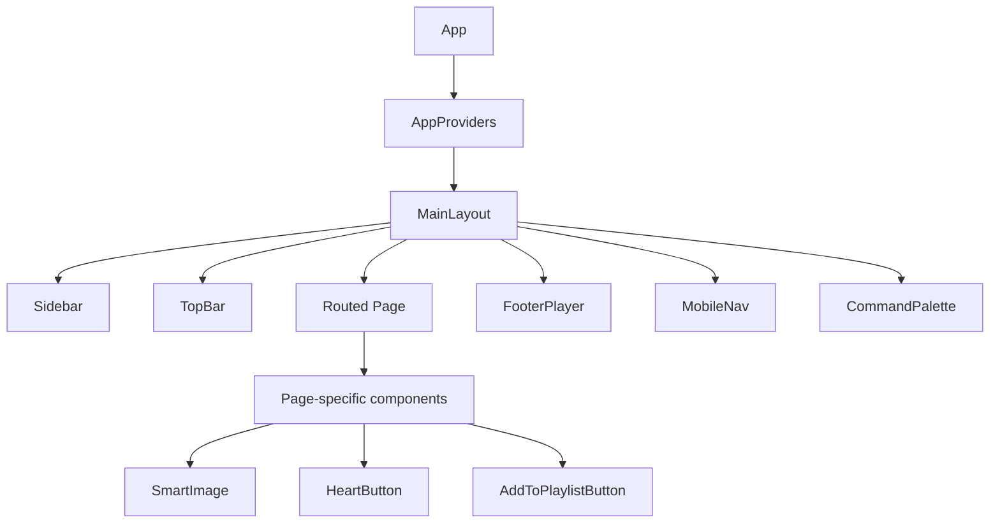

# Components

> **What you'll learn here:** Octavia's major React components, organized by domain. For each you'll find what it does, its props, internal state, the actions it triggers, its children, and its parents.

There are ~150 component files under `src/components/`. This documentation covers the **major product components** grouped by domain (one doc file per domain), and explains the two design-system folders. It deliberately skips the low-level `src/components/ui/` primitives (documented as a group) and test files.

## Component domains

| Domain | Folder | Doc |
|--------|--------|-----|
| Layout (app shell) | `src/components/layout/` | [layout.md](./layout.md) |
| Player | `src/components/player/` | [player.md](./player.md) |
| Home | `src/components/home/` | [home.md](./home.md) |
| Charts | `src/components/charts/` | [charts.md](./charts.md) |
| Search | `src/components/search/` | [search.md](./search.md) |
| Explore | `src/components/explore/` | [explore.md](./explore.md) |
| Playlist | `src/components/playlist/` | [playlist.md](./playlist.md) |
| Common / shared | `src/components/` (top-level), `common/`, `brand/` | [common.md](./common.md) |
| Auth route guards | `src/components/auth/` | [auth.md](./auth.md) |
| Design systems (`ui/` & `ui-v2/`) | `src/components/ui/`, `ui-v2/` | [design-system.md](./design-system.md) |

## How components get their data

Most components are **presentational** and receive data via props from a page (see [../pages/README.md](../pages/README.md)). The exceptions are a handful of "smart" components that read from **context hooks** directly:

- `usePlayer` — playback state & controls
- `useFavorites`, `useLikedAlbums`, `useFollowedArtists` — library collections
- `usePlaylists` / `usePlaylistActions` — playlists
- `useSettings` — preferences
- `useUI` — drawer/palette/modal open state
- `useAuth` — current user

See [../state-management.md](../state-management.md) for how these contexts are structured.

## Component hierarchy (high level)

## Cross-cutting conventions

- **Performance**: list rows (charts, queue, search, trending) are wrapped in `React.memo` with stable `useCallback` handlers; the footer isolates per-second progress so the whole bar doesn't re-render each tick.
- **Naming collision**: there are two `RelatedRail`s — `PlayerRelatedRail` (player history suggestions) and `SearchRelatedRail` (search top-result context). They're distinct.
- **Lazy loading**: heavy components (`ReactPlayer`, `CommandPalette`, `MobileDrawer`) are code-split.
- **Prefer `ui-v2`** for product UI (buttons, headers, empty states); reach for `ui/` only for low-level overlays/form controls. See [design-system.md](./design-system.md).
