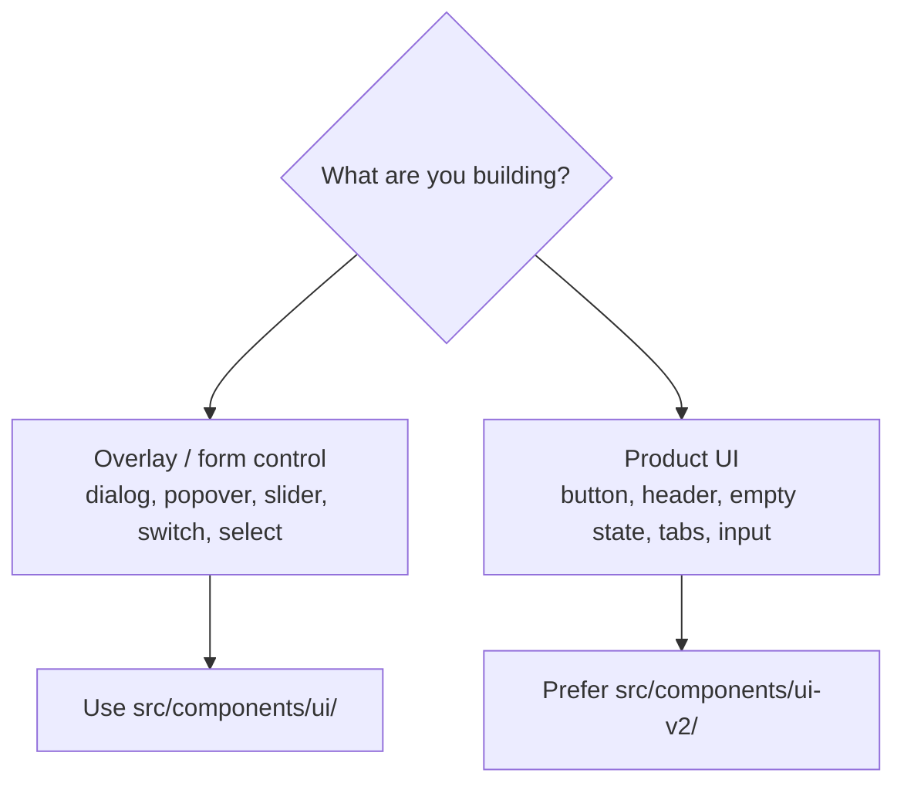

# Components · Design Systems (`ui/` and `ui-v2/`)

> **What you'll learn here:** the two component libraries in the codebase, what each is for, and which one to reach for when building UI.

Octavia has **two** layers of reusable UI components. Knowing the difference saves a lot of confusion.

**Folders:** `src/components/ui/` (shadcn/Radix primitives) and `src/components/ui-v2/` (Octavia's branded design system).

---

## `src/components/ui/` — shadcn/ui primitives

These are **unstyled, accessible primitives** generated by [shadcn/ui](https://ui.shadcn.com/) on top of [Radix UI](https://www.radix-ui.com/). They are the low-level building blocks: accessibility, focus management, and keyboard behavior are handled here; the visual styling is Tailwind classes applied in-house.

Examples present: `dialog`, `popover`, `slider`, `sheet`, `dropdown-menu`, `context-menu` (via `TrackContextMenu`), `tooltip`, `switch`, `select`, `tabs`, `toast`/`toaster`, `scroll-area`, `collapsible`, `label`, `textarea`, `badge`, `progress`, `skeleton`, `aspect-ratio`.

**Use these for:** overlays (dialogs, popovers, sheets, tooltips), form controls (switch, select, slider, textarea), and anything needing solid accessibility plumbing that ui-v2 doesn't yet wrap.

> Because the source lives in the repo, you can edit these directly — but be careful: they're shared widely. See the shadcn pattern in [../tech-stack.md](../tech-stack.md).

---

## `src/components/ui-v2/` — Octavia's branded design system

These are **branded compositions** matching Octavia's editorial/magazine visual language: mono eyebrows, serif accents, track-colored active states, glass surfaces, and a `rounded-sharp`/`rounded-soft` vocabulary. They're meant for **product/feature UI**, often built on top of the `ui/` primitives and the design tokens.

| Component | Role |
|-----------|------|
| `SectionHeader` | Eyebrow + § ordinal + title + optional subtitle/rule/action; sizes `lg`/`md`/`sm` |
| `SectionRule` | In-section divider with § ordinal, label, gradient hairline, trailing slot |
| `EmptyState` | Centered empty UI with an iris-orbit icon ring + actions |
| `KindBadge` | Tiny badge for non-song kinds (currently `video`) |
| `Tabs` | `pill` or `underline` variants; roving tabindex; optional `count` per item |
| `Input` | Branded text input (Search, Login, Account) |
| `Stat` | A metric display block |
| `Kbd` | Keyboard-hint chips |
| `Button` | The primary design-system button (`premium`, `editorial`, `glass`, … variants) |
| `Skeleton` | Loading placeholders (`variant="iris"`) |
| `Surface` | A layout surface wrapper |

---

## Which one should I use?

- **Building feature UI?** Reach for **`ui-v2`** first (buttons, section headers, empty states, tabs, inputs) so it matches the brand.
- **Need a low-level overlay or form control** not yet duplicated in ui-v2? Use **`ui`**.

## Key things to remember

- **`ui/` = accessible primitives** (shadcn/Radix); **`ui-v2/` = branded compositions**.
- Default to **`ui-v2`** for anything users see as "Octavia"; drop to `ui/` only for plumbing.
- Both are in-repo and editable, but they're widely shared — change with care.
