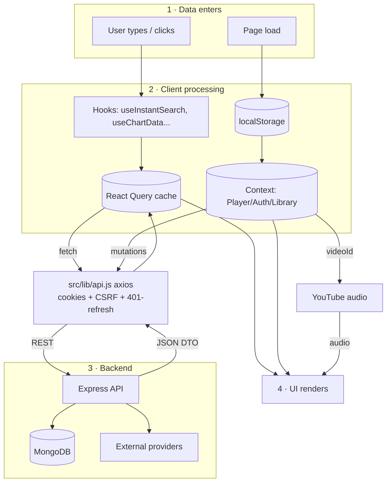
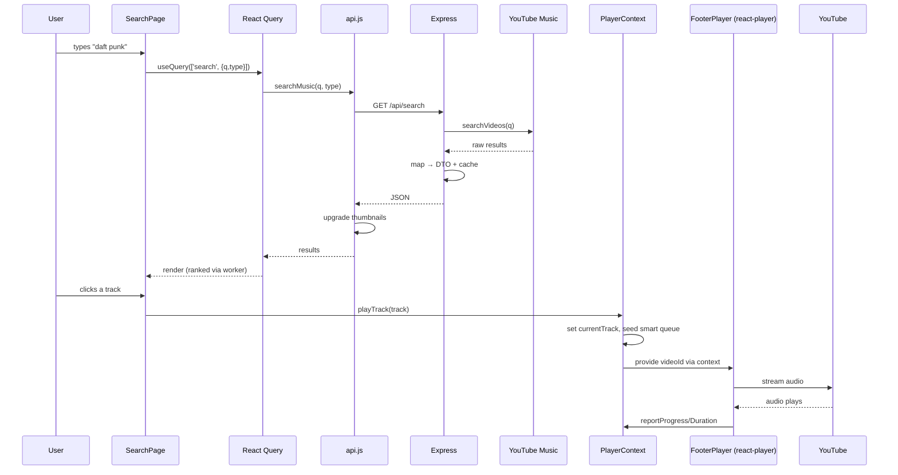

# Data Flow

> **What you'll learn here:** how data gets into the app, how it moves between components, how it's sent back to the server, and a full end-to-end walkthrough of a real feature (search → play). Read [state-management.md](./state-management.md) first for the vocabulary.

---

## The three ways data enters the app

1. **API calls** — the main source. Every catalog query, chart, lyric, and library list comes from the Express backend through `src/lib/api.js` (axios). React Query usually orchestrates these.
2. **User input** — typing in search, dragging the seek bar, toggling settings, filling auth forms.
3. **Local persistence** — `localStorage` restores guest settings, the last queue, recent searches, and explore taste on page load.

There's also a **fourth, separate stream that is not "data"**: the audio bytes, which flow straight from YouTube into the embedded `react-player` and never touch Octavia's code.

---

## How data moves between components

Octavia uses several mechanisms depending on the relationship between components:

| Mechanism | When it's used | Example |
|-----------|----------------|---------|
| **Props** | Parent → child, one level | `HomePage` passes a `track` to `<TileCard>` |
| **Context** | Widely-shared session/UI state | Any component calls `usePlayer()` to play a track |
| **React Query cache** | Server data shared across screens | `SearchPage` and the TopBar share the same `['search', ...]` cache |
| **URL params** | Shareable, navigable state | `/search?q=...`, `/charts?mode=artists` |
| **Events/callbacks** | Child → parent actions | A row calls `onPlay(track)` passed by its list |
| **Refs** | Imperative control | `playerRef` lets the context seek the media element |

The general principle: **read shared state from Context or React Query; pass specifics down via props; bubble actions up via callbacks.**

---

## How data is sent back to the server

All writes go through `src/lib/api.js`, which is a single configured axios instance. It automatically:
- Sends cookies (`withCredentials: true`) so the session travels with every request.
- Attaches the **CSRF token** header (`x-csrf-token`) on mutating requests (POST/PUT/PATCH/DELETE).
- On a `401`, transparently calls `POST /auth/refresh` **once** and retries the original request (a single-flight queue prevents a refresh stampede).

Writes happen in two main ways:
- **Optimistic mutations** (library data): update the React Query cache immediately, then `POST/PATCH/DELETE`, rolling back on error. See the favoriting example in [state-management.md](./state-management.md).
- **Form submissions** (auth): `react-hook-form` validates with Zod, then calls an `AuthContext` action which hits `/auth/*`.

---

## Complete data-flow diagram

---

## The dominant pattern: "fetch → cache → render → mutate optimistically"

Almost every feature follows this shape:

1. A **hook** declares what data it needs with `useQuery(key, fetcher)`.
2. **React Query** checks its cache; if stale/missing it calls the **fetcher** (a function in `api.js`).
3. `api.js` makes the **HTTP request**; the backend returns a clean **DTO** (already shaped for the UI).
4. The component **renders** the cached data, handling `isLoading`/`isError`/empty states.
5. When the user **acts** (favorite, add to playlist), a **mutation** updates the cache optimistically and syncs to the server.

---

## End-to-end walkthrough: search a song, then play it

This is the single most important flow to understand. It touches input, debouncing, caching, ranking, Context, and playback.

### Step 1 — The user types in search
On `/search` (`src/pages/SearchPage.jsx`), keystrokes update local state and the URL (`?q=...`). The query is **debounced** so we don't fire a request on every keystroke.

### Step 2 — React Query fetches results
A `useQuery(['search', { q, type, limit }], () => searchMusic(q, type, { limit }))` runs. `searchMusic` (in `api.js`) calls `GET /api/search?q=...&type=...`. `keepPreviousData` keeps the old results visible while the new ones load (no flicker).

### Step 3 — The backend aggregates and shapes
Express runs the request through rate-limiting → the search controller → `search.service.js`, which queries YouTube Music (`server/lib/ytmusic.js`), maps the raw results into clean track/album/artist DTOs (`server/lib/mappers.js`), caches them in memory, and returns JSON. (If the live call fails, it falls back to the static catalog.)

### Step 4 — Results are ranked client-side
`api.js` upgrades thumbnail URLs, then `useRankedSearch` re-ranks/merges results (mixing in your library + personalization signals). For large result sets (≥ 50 candidates) the ranking runs in a **Web Worker** (`search-rank.worker.js`) to keep the UI smooth.

### Step 5 — The UI renders
Rows, a "top result" card, and related rails render. Empty/error/idle states are handled (idle shows presets + recent + trending chips).

### Step 6 — The user clicks a track to play
The row calls `playTrack(track)` from `usePlayer()` (PlayerContext). This:
- sets `currentTrack` + `isPlaying`,
- seeds the queue in **smart mode**,
- kicks off an async **smart-queue fill** (`getExploreSimilar` + `getExploreRadio`) to auto-queue similar songs,
- if authenticated, fire-and-forget records the play to `POST /me/history`.

### Step 7 — Audio streams from YouTube
`FooterPlayer.jsx` (always mounted in the layout) reads the track's `videoId` and hands it to the lazy-loaded `react-player`, which streams audio **directly from YouTube**. As it plays, the player reports `progress`/`duration` back into `PlayerProgressContext`, driving the seek ring/bar. Because the player lives in the layout (not the page), playback continues uninterrupted while you navigate.

---

## Other notable flows

### App boot + auth
On load, `AuthContext` calls `GET /auth/me`; a 401 triggers one `POST /auth/refresh`. Result sets `status` to `authenticated` or `guest`, which gates protected routes and enables `['me', ...]` queries. See [authentication.md](./authentication.md).

### Settings change (authenticated)
`updateSetting('theme', 'midnight')` → optimistic `setQueryData(['me','settings'])` → `PATCH /me/settings`. Separately, `SettingsEffects` writes `data-theme` to `<html>` and caches it to `octavia.appearance.v1` so the next page load doesn't flash the wrong theme.

### Guest → authenticated migration
A guest accrues settings + recent searches in `localStorage`. On login, `SettingsContext` merges guest preferences into the server account and clears the local copy, so your choices follow you.

### Charts (auto-refreshing server data)
`useChartData` fetches `/charts` with a `staleTime` tied to the selected time window (`today` refreshes faster than `all_time`) and polls in the background, surfacing `lastUpdated` and stale warnings. The backend serves charts via the Last.fm → enrich (YTM + MusicBrainz) → DTO pipeline with stale-while-revalidate caching.

---

## Key things to remember

- **Data in:** API calls (most), user input, and `localStorage` restore. **Audio is a separate path** straight from YouTube.
- **Backend returns ready-to-render DTOs**, so components rarely reshape data.
- **React Query caches and dedupes**; **Context shares session state**; **callbacks bubble actions up**; **URL holds shareable state**.
- **Writes are optimistic** for library data and go through one axios instance that manages cookies, CSRF, and 401-refresh automatically.
- The **search → play** flow is the canonical example — learn it and most of the app makes sense.
