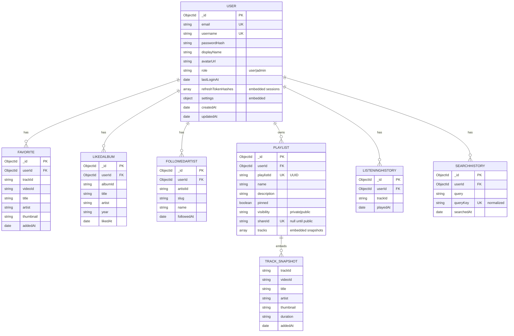

# Database

> **What you'll learn here:** the database Octavia uses, every collection and field, the relationships between them, an entity-relationship diagram, how the app connects, and the important query patterns. Source of truth: `server/src/models/`.

---

## What database, and why

Octavia uses **MongoDB**, a document (NoSQL) database, accessed through **Mongoose** (an Object-Document Mapper that adds schemas and validation on top of MongoDB).

**Why MongoDB?**
- The data is naturally **document-shaped**. A playlist, for example, embeds a list of track snapshots — there's no need for joins.
- **Schema flexibility** suits the evolving `settings` object on each user.
- Embedding **track snapshots** (a copy of the track's title/artist/thumbnail at the time of saving) means a playlist or favorite still renders correctly even if the live YouTube Music catalog is unreachable. The app never depends on the live catalog to show your saved items.

**What's stored:** only **user-owned data**. The music catalog itself (songs, albums, artists) is **never** persisted — it's fetched live from external providers and cached in memory. So the database is small and entirely about *your* account and library.

---

## Collections overview

| Collection (Mongoose model) | Stores | One per |
|------------------------------|--------|---------|
| `users` (`User`) | Accounts, password hash, role, settings, refresh-token hashes | user |
| `favorites` (`Favorite`) | Liked tracks (with metadata snapshot) | user + track |
| `likedalbums` (`LikedAlbum`) | Saved albums | user + album |
| `followedartists` (`FollowedArtist`) | Followed artists | user + artist |
| `playlists` (`Playlist`) | Playlists with embedded track snapshots | playlist |
| `listeninghistories` (`ListeningHistory`) | Recently played (capped 20 per user) | user + track |
| `searchhistories` (`SearchHistory`) | Recent searches (capped 50 per user) | user + query |

Every collection (except `users`) is owned by a user via a `userId` reference, and every one of those has a **unique compound index** that prevents duplicates (e.g. you can't favorite the same track twice).

---

## Entity-relationship diagram



---

## Collection details

### `users` (`server/src/models/User.js`)

The central account record.

| Field | Type | Notes |
|-------|------|-------|
| `email` | String | **Required, unique, indexed.** Lowercased, trimmed, validated against an email regex. |
| `username` | String | **Required, unique, indexed.** 3–32 chars, pattern `^[a-zA-Z0-9._-]+$`. |
| `passwordHash` | String | **Required.** Hashed with bcrypt in a `pre('save')` hook (skips re-hashing if already a bcrypt hash). |
| `displayName` | String | Required, max 80 chars. |
| `avatarUrl` | String | Default `null`. A small base64 data URL or http(s) URL. |
| `role` | String | Enum `user` \| `admin`, default `user`, **indexed**. |
| `lastLoginAt` | Date | Default `null`. |
| `refreshTokenHashes` | Array of sub-docs | One row **per active session**: `{ jti, hash, createdAt, expiresAt, userAgent, ip }`. The token itself is never stored — only a SHA-256 hash. See [authentication.md](./authentication.md). |
| `settings` | Sub-doc | The user's preferences (see below). |
| `createdAt` / `updatedAt` | Date | Auto (timestamps). |

**Embedded `settings` sub-document** (defaults in `USER_SETTINGS_DEFAULTS`):

| Field | Type | Default | Allowed |
|-------|------|---------|---------|
| `highQualityAudio` | Boolean | `true` | |
| `crossfadeSeconds` | Number | `0` | 0–12 |
| `autoplay` | Boolean | `true` | |
| `reduceMotion` | Boolean | `false` | |
| `notifyNewReleases` | Boolean | `true` | |
| `notifyPlaylistUpdates` | Boolean | `false` | |
| `displayName` | String | `Music Lover` | |
| `email` | String | `user@example.com` | |
| `sidebarExpanded` | Boolean | `false` | |
| `theme` | String | `dark` | `dark, oled, light, hicontrast, midnight, sepia, forest, slate` |
| `accentColor` | String | `dynamic` | `dynamic, ember, rose, amber, lime, emerald, teal, azure, indigo, violet, magenta` |
| `textSize` | String | `md` | `sm, md, lg` |
| `vimNavigation` | Boolean | `false` | |
| `soundEffects` | Boolean | `false` | |

**Security transforms (`toJSON`):** the serialized user always exposes `id` (string) instead of `_id`, and **strips `passwordHash` and `refreshTokenHashes`** so they never leave the server. There's also a `comparePassword(raw)` method and `toSafeJSON()`.

### `favorites` (`Favorite.js`)
A liked track plus a **snapshot** of its metadata (so it renders without a live lookup).

| Field | Type | Notes |
|-------|------|-------|
| `userId` | ObjectId → `User` | Required, indexed. |
| `trackId` | String | Required. |
| `videoId`, `title`, `artist`, `artistId`, `artistSlug`, `albumId`, `thumbnail`, `duration` | String | Snapshot fields. |
| `addedAt` | Date | Default now. |

**Indexes:** `{ userId, createdAt: -1 }` (list newest first) and **unique `{ userId, trackId }`** (no duplicate favorites). `toJSON` exposes `id = trackId` and `addedAt` as epoch ms.

### `likedalbums` (`LikedAlbum.js`)
| Field | Type | Notes |
|-------|------|-------|
| `userId` | ObjectId → `User` | Required, indexed. |
| `albumId` | String | Required. |
| `title`, `artist`, `artistSlug`, `thumbnail`, `year` | String | Snapshot. |
| `likedAt` | Date | Default now. |

**Indexes:** `{ userId, createdAt: -1 }`, unique `{ userId, albumId }`. `toJSON` → `id = albumId`.

### `followedartists` (`FollowedArtist.js`)
| Field | Type | Notes |
|-------|------|-------|
| `userId` | ObjectId → `User` | Required, indexed. |
| `artistId` | String | Required. |
| `slug`, `name`, `thumbnail` | String | Snapshot. |
| `followedAt` | Date | Default now. |

**Indexes:** `{ userId, createdAt: -1 }`, unique `{ userId, artistId }`. `toJSON` → `id = artistId`.

### `playlists` (`Playlist.js`)
The richest model — tracks are **embedded**, not referenced.

| Field | Type | Notes |
|-------|------|-------|
| `userId` | ObjectId → `User` | Required, indexed. |
| `playlistId` | String | Required, **UUID** by default (stable client-facing id). |
| `name` | String | Required, max 120. |
| `description` | String | Default `''`, max 500. |
| `pinned` | Boolean | Default `false` (pin to sidebar). |
| `visibility` | String | Enum `private` \| `public`, default `private`, indexed. |
| `shareId` | String | `null` until the playlist is first made public; then a stable URL-safe token used by `/shared/:shareId`. |
| `tracks` | Array of embedded snapshots | Each has the track-snapshot fields + `addedAt`. |

**Indexes:** `{ userId, createdAt: -1 }`, unique `{ userId, playlistId }`, and **unique + sparse `{ shareId }`** (sparse so many `null` shareIds don't collide). `toJSON` exposes `id = playlistId`, converts timestamps to epoch ms, and reshapes each embedded track to `{ id, videoId, title, ... addedAt }`.

> **Why embed tracks instead of referencing a Track collection?** There is no Track collection — catalog data isn't stored. Embedding the snapshot means a playlist is fully self-contained and renders even when YouTube Music is down.

### `listeninghistories` (`ListeningHistory.js`)
Recently played tracks. Same snapshot fields as `Favorite` plus `playedAt`. **Unique `{ userId, trackId }`** — there's one row per track that's *updated* on replay (not appended), so history is deduped. The service caps it at **20** rows per user. Indexes also on `{ userId, playedAt: -1 }`.

### `searchhistories` (`SearchHistory.js`)
Recent searches. Stores both `query` (original casing) and `queryKey` (lowercased, for dedupe). **Unique `{ userId, queryKey }`**, capped at **50** per user in the service. `toJSON` → `id = queryKey`.

---

## The shared track-snapshot schema

`server/src/models/shared.js` defines `trackSnapshotSchema`, reused by `Favorite`, `ListeningHistory`, and (spread into) `Playlist`'s embedded tracks:

```js
{ trackId, videoId, title, artist, artistId, artistSlug, albumId, thumbnail, duration, createdAt }
```

This consistency means the frontend gets the same track shape everywhere it appears.

---

## How the app connects

`server/src/db/connect.js` manages the Mongoose connection:

- Global safety settings: `strictQuery: true`, `strict: 'throw'` (reject unknown fields), `sanitizeFilter: true` (guards against query injection).
- Connection options: `maxPoolSize: 10`, `serverSelectionTimeoutMS: 7000`.
- **Retry with backoff:** up to **5 attempts**, delay `800ms × attempt`.
- **No `MONGODB_URI`:**
  - In **development** → logs a warning, returns `false`, and the **server still starts** (music browsing works; auth/library routes return 503 via the `db-ready` middleware).
  - In **production** → throws, so the server refuses to start without a database.

The connection is established once at boot (`server/index.js`), *before* the server begins listening.

---

## Important queries & operations

- **Dedupe upserts:** favorites/liked-albums/followed-artists/history are upserted on their unique compound index, so toggling on/off is idempotent.
- **Caps enforced in the service layer** (`library.service.js`): listening history is trimmed to 20, search history to 50 (the constants `LISTENING_HISTORY_CAP` and `SEARCH_HISTORY_CAP`).
- **Public share lookups:** `getSharedPlaylist(shareId)` finds a `public` playlist by its sparse-unique `shareId` and exposes only the owner's `displayName`.
- **Cascade delete:** when an admin deletes a user (`deleteUser`), the service removes **all** of that user's documents across every collection.
- **`shareId` generation:** created lazily (a 9-byte base64url token) the first time a playlist is made public, then kept stable so links never break.

---

## Key things to remember

- **MongoDB stores only user-owned data.** Catalog data is fetched live + cached in memory, never persisted.
- **Track snapshots are embedded** in favorites/playlists/history so your library renders even when external sources are down.
- **Every user-owned collection has a unique compound index** (`{ userId, <thing>Id }`) preventing duplicates.
- **`passwordHash` and `refreshTokenHashes` never leave the server** (stripped in `toJSON`).
- **In dev, the app runs without a database** — only auth + `/me/*` routes need it (they return 503 otherwise).
- See [authentication.md](./authentication.md) for the `refreshTokenHashes` session model and [api/](./api/) for the endpoints that read/write these collections.
