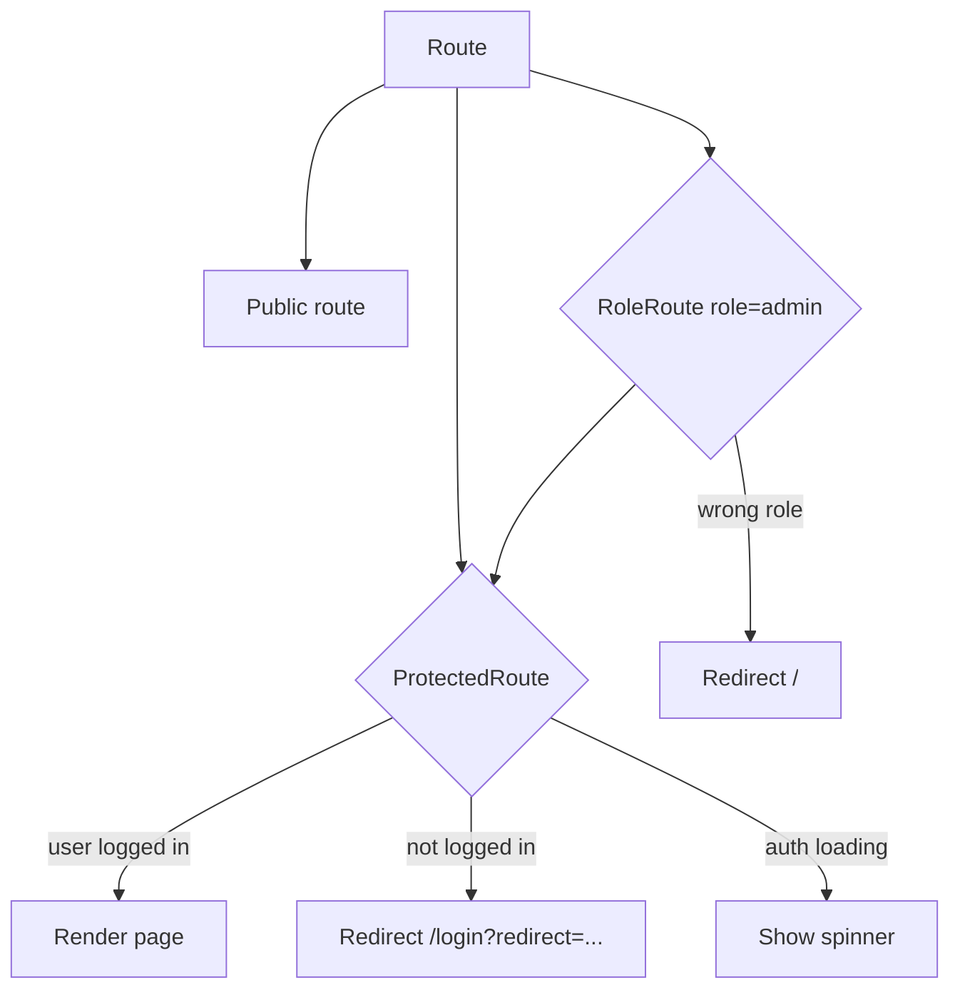

# Pages & Routes

> **What you'll learn here:** every route in Octavia, what each page does, which components build it, where its data comes from, and any auth/redirect logic. One file per route.

All routes are declared in `src/app/App.jsx`. Pages are **lazy-loaded** (code-split) and wrapped in `<Suspense>` with a spinner fallback. The real page implementations live in `src/pages/*.jsx`; the `src/features/*/pages/*.jsx` files are thin re-exports (see [folder-structure.md](../folder-structure.md)).

## Route map

| Route | Page | Access | Doc |
|-------|------|--------|-----|
| `/` | Home | Public | [home.md](./home.md) |
| `/search` | Search | Public | [search.md](./search.md) |
| `/player` | Now Playing | Public | [player.md](./player.md) |
| `/trending` | Trending | Public | [trending.md](./trending.md) |
| `/charts` | Charts | Public | [charts.md](./charts.md) |
| `/charts/artists` | Charts (artists alias) | Public | [charts.md](./charts.md) |
| `/explore` | Explore | Public | [explore.md](./explore.md) |
| `/explore/flow` | Explore Flow | Public (flag) | [explore-flow.md](./explore-flow.md) |
| `/genres` | Genres | Public | [genres.md](./genres.md) |
| `/artist/:slug` | Artist | Public | [artist.md](./artist.md) |
| `/album/:id` | Album | Public | [album.md](./album.md) |
| `/shared/:shareId` | Shared Playlist | Public | [shared-playlist.md](./shared-playlist.md) |
| `/favorites` | Favorites | **Protected** | [favorites.md](./favorites.md) |
| `/library` | Library | **Protected** | [library.md](./library.md) |
| `/playlist/:id` | Playlist | **Protected** | [playlist.md](./playlist.md) |
| `/settings` | Settings | **Protected** | [settings.md](./settings.md) |
| `/account` | Account | **Protected** | [account.md](./account.md) |
| `/admin` | Admin | **Admin only** | [admin.md](./admin.md) |
| `/login` `/register` `/forgot-password` | Auth pages | Public (no shell) | [auth.md](./auth.md) |
| `*` | 404 Not Found | Public (no shell) | [not-found.md](./not-found.md) |

## Access levels explained

- **Public** — anyone can view (most browse pages).
- **Protected** — wrapped in `<ProtectedRoute>`; redirects to `/login?redirect=<intended path>` if not signed in. See [authentication.md](../authentication.md).
- **Admin only** — wrapped in `<RoleRoute role="admin">` (which itself requires auth first); non-admins are sent to `/`.
- **No shell** — login/register/forgot-password/404 render **outside** `MainLayout` (no sidebar/top bar/player).

## Things every page shares

- **`MainLayout`** wraps all routes except the auth pages and 404 — it provides the sidebar, top bar, footer player, and mobile nav. See [../components/layout.md](../components/layout.md).
- **`registerPrefetch()`** warms a route's JS chunk when you hover its link, so navigation feels instant.
- **`RouteHead`** sets the page `<title>`/meta per route.
- Most data is fetched with **React Query** hooks; see [../state-management.md](../state-management.md) and [../data-flow.md](../data-flow.md).
