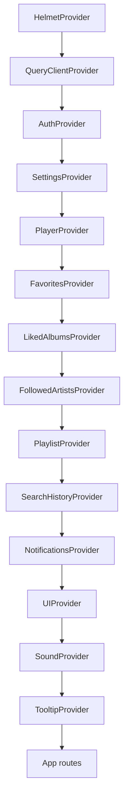
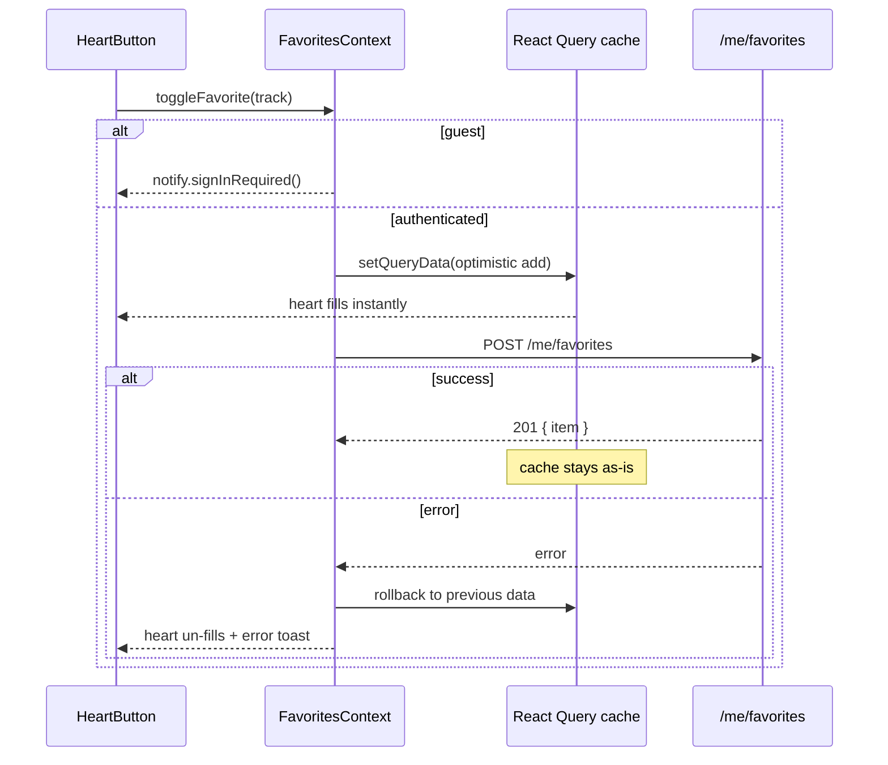
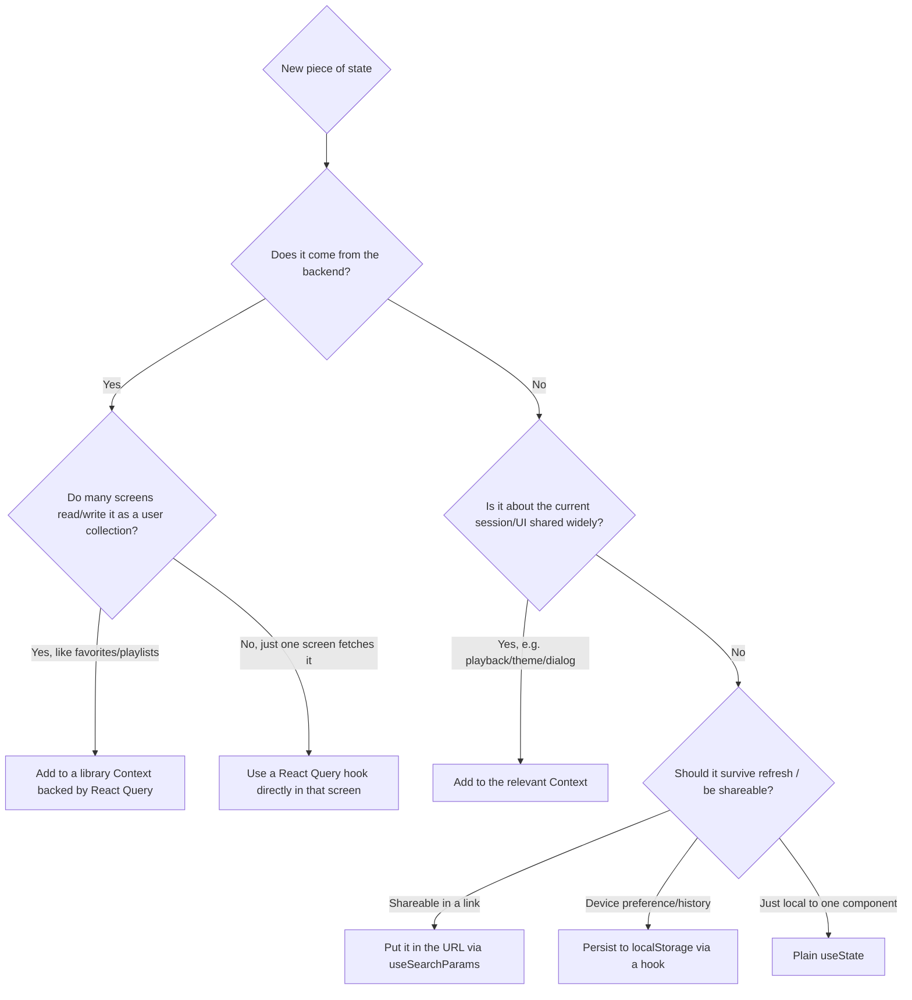

# State Management

> **What you'll learn here:** how Octavia decides where state lives, the difference between "server state" and "client state", every Context provider and what it holds, how data is persisted, and a decision guide for where to put new state when you build a feature.

---

## The core idea: a hybrid model

Octavia uses **three** places to store state, each for a different kind of data:

| Layer | Tool | Good for | Example |
|-------|------|----------|---------|
| **Server state** | **React Query** (TanStack Query) | Data that comes from the backend and can go stale | Search results, charts, album details, your favorites list |
| **Client state** | **React Context** | Session/UI/runtime state shared across components | Current track, theme, queue, command-palette open? |
| **Device-local state** | **`localStorage`** | Preferences/history that should survive a refresh (esp. for guests) | Guest settings, recent searches, explore taste profile |

The most important distinction is **server vs client state**:
- If the data *originates on the server* and could be out of date → **React Query**.
- If the data is about *this browser session or the UI right now* → **Context**.

Some library data (favorites, playlists) is *both* server data **and** something many components need. Octavia handles this with a clever pattern: **a Context that wraps a React Query cache** and exposes a friendly domain API. You get React Query's caching + a simple `useFavorites()` hook.

---

## React Query configuration

Defined once in `src/app/providers.jsx`:

```js
new QueryClient({
  defaultOptions: {
    queries: {
      retry: 1,                     // retry a failed fetch once
      refetchOnWindowFocus: false,  // don't refetch just because you tabbed back
      staleTime: 60000,             // data is "fresh" for 60s before a refetch is considered
      gcTime: 60 * 60 * 1000,       // keep unused cache for 1 hour
    },
  },
});
```

Per-resource overrides (e.g. charts refetch faster, search uses `keepPreviousData`) live in `src/lib/query-keys.js` alongside the **query-key factories**. A query key uniquely identifies a cache entry; the factories keep them consistent so different parts of the app share the same cache.

### Common query keys

| Data | Key pattern | Exposed via |
|------|-------------|-------------|
| Home feed | `['home', { limit }]` | `HomePage` |
| Trending | `['trending', { limit }]` | pages/hooks (shared with Home) |
| Charts | `['charts', { region, window, limit }]` | `useChartData` |
| Search | `['search', { q, type, limit }]` | `useInstantSearch`, `SearchPage` |
| Album / Artist | `['album', id]`, `['artist', slug]` | detail pages + prefetch |
| Genres | `['genres']` | Home, Genres, Explore |
| Explore | `['explore', ...]` | discovery hooks |
| Lyrics | `['lyrics', {...}]` | `LyricsPanel` |
| User settings | `['me', 'settings']` | `SettingsContext` |
| Favorites | `['me', 'favorites', userId]` | `FavoritesContext` |
| Liked albums | `['me', 'liked-albums', userId]` | `LikedAlbumsContext` |
| Followed artists | `['me', 'followed-artists', userId]` | `FollowedArtistsContext` |
| Playlists | `['me', 'playlists', userId]` | `PlaylistContext` |
| Search history | `['me', 'searches', userId]` | `SearchHistoryContext` |
| Shared playlist | `['playlists', 'shared', shareId]` | `SharedPlaylistPage` |
| Admin users | `['admin', 'users']` | `AdminPage` |

> **Notice the `userId` in library keys.** When you log out, `userId` changes, so React Query treats it as a different cache — your data doesn't leak between accounts. On logout the app also calls `queryClient.removeQueries({ queryKey: ['me'] })` to wipe it entirely.

---

## The provider tree

All providers are nested in `src/app/providers.jsx`, in this exact order (outer → inner). **Order matters** because inner providers depend on outer ones.



Dependencies worth noting:
- `SettingsProvider` and `PlayerProvider` read `useAuth()` (to know if there's a logged-in user).
- `PlayerProvider` reads `useSettings()` (autoplay, crossfade, audio quality).
- `NotificationsProvider` reads Settings + FollowedArtists + LikedAlbums + Playlists (to generate activity notifications), so it must sit inside all of them.
- `SoundProvider` reads Settings (the "sound effects" toggle).

---

## Each Context in detail

### AuthContext — `src/contexts/AuthContext.jsx`
**Holds:** `user` (object or `null`) and `status` (`'loading'` | `'guest'` | `'authenticated'`).
**Exposes:** `{ user, status, login, register, logout, refresh, updateProfile, isAuthenticated }`.
**Init:** On mount it wires axios (`configureApiAuth`) then calls `GET /auth/me`; on a 401 it tries `POST /auth/refresh` once, then re-checks. Failure → guest.
**Persistence:** Cookie-based session (no user in `localStorage`). The CSRF token is kept in memory.
**Side effects:** On logout/auth-failure it clears the CSRF token, removes all `['me', ...]` React Query caches, and clears legacy library `localStorage` keys.
**Roles:** `user.role` is a single string (`'user'` | `'admin'`), used by `RoleRoute`.

### SettingsContext — `src/contexts/SettingsContext.jsx`
**Holds:** the merged `settings` object (theme, accent, audio quality, crossfade, autoplay, reduce motion, text size, vim nav, sound effects, notification prefs, etc.).
**Exposes:** `{ settings, updateSetting, resetSettings, importSettings }`.
**Init:** Guests read from `localStorage` (`octavia.settings.v1`); authenticated users read from `useQuery(['me', 'settings'])`.
**Persistence:** Guests → `localStorage`; authenticated → optimistic `setQueryData` + `PATCH /me/settings`.
**Clever bit:** On login, it diffs guest settings vs server defaults and merges your guest preferences up to the server, then clears the local copy. Theme/accent are applied to `<html>` by `SettingsEffects` (see [styling-guide.md](./styling-guide.md)).

### PlayerContext — `src/contexts/PlayerContext.jsx`
The most complex context. It's **split into two** for performance:
- `PlayerContext` — durable playback state (current track, queue, volume, shuffle, repeat).
- `PlayerProgressContext` — just `{ progress, duration }`, which updates many times per second. Splitting it means a moving progress bar doesn't re-render the whole app.

**Holds:** `currentTrack`, `isPlaying`, `volume`, `isMuted`, `queueState` (`{ tracks, currentIndex, queueMode }`), `queueMode` (`manual` | `collection` | `smart`), `history` (last 20), `shuffle`, `repeat` (`off`|`all`|`one`), `playerRef`.
**Exposes (controls):** `playTrack`, `togglePlay`, `pause`, `setVolume`, `toggleMute`, `seekTo`, `addToQueue`, `playTracksInOrder`, `playTrackNext`, `removeFromQueue(At)`, `reorderQueue`, `clearQueue`, `playNext`, `playPrevious`, `toggleShuffle`, `toggleRepeat`, `handleTrackEnded`, `reportProgress`, `reportDuration`, `canGoNext/Previous`.
**Init/persist:** A slim snapshot (track, volume, queue, mode, shuffle, repeat) is saved to `localStorage` (`octavia.player.v1`); history is in-memory only locally.
**Smart queue:** the default `playTrack` mode seeds a queue and then **asynchronously** fills it with similar/radio tracks (`getExploreSimilar` + `getExploreRadio`). When a track ends with autoplay on, it extends the smart queue.
**History (auth):** loads `GET /me/history` on login, and fire-and-forget `POST /me/history` when a track changes.
**Audio:** The actual `react-player` lives in `FooterPlayer.jsx`; it reads `playerRef` and reports progress/duration/ended back into the context.

### FavoritesContext — `src/contexts/FavoritesContext.jsx`
**Holds:** `favorites` (a `Record<trackId, …>`) and `list` (sorted by `addedAt`).
**Exposes:** `{ favorites, list, count, isFavorite, toggleFavorite, removeFavorite }`.
**Backed by:** React Query `['me', 'favorites', userId]` + `GET/POST/DELETE /me/favorites`. Optimistic updates with rollback. Guests get an empty set and a "sign in" prompt.

### LikedAlbumsContext / FollowedArtistsContext
Same pattern as Favorites, for albums (`['me','liked-albums',userId]`) and artists (`['me','followed-artists',userId]`). Expose `isLiked/toggleLiked` and `isFollowing/toggleFollow` respectively.

### PlaylistContext — `src/contexts/PlaylistContext.jsx`
**Holds:** `playlists` array.
**Exposes:** `createPlaylist`, `deletePlaylist`, `updatePlaylist`, `addTrackToPlaylist`, `removeTrackFromPlaylist`, `reorderTracks`, `togglePin`, `reorderPlaylists`, `setPlaylistVisibility`, `importSharedPlaylist`.
**Backed by:** `['me','playlists',userId]` + the `/me/playlists` API. All mutations are optimistic with rollback. Making a playlist public reconciles a `shareId` from the server.

### SearchHistoryContext — `src/contexts/SearchHistoryContext.jsx`
**Holds:** `searches` (most-recent-first strings). Guests use `localStorage` (cap 8); authenticated users use `['me','searches',userId]` + `/me/searches` (cap 50 server-side). Has safe no-op defaults if used outside the provider.

### NotificationsContext — `src/contexts/NotificationsContext.jsx`
**Holds:** an in-app activity feed (`items`, `unreadCount`).
**Exposes:** `add`, `markAllRead`, `clear`.
**Persistence:** `localStorage` (`octavia.notifications.v1`, max 30) — **device-local, no backend**.
**Auto-tracking:** watches FollowedArtists/LikedAlbums/Playlists counts (gated by notification settings) and creates notifications when they grow.

### UIContext — `src/contexts/UIContext.jsx`
**Holds:** ephemeral UI state — `paletteOpen` (⌘K), `mobileDrawerOpen`, and a `searchInputRef`.
**Exposes:** open/close/toggle functions + `focusGlobalSearch()`. Not persisted.

### SoundContext — `src/contexts/SoundContext.jsx`
**Holds:** nothing persistent; exposes `play(name)` for UI sound effects (`click`/`pop`/`whoosh`/`tick`) using the Web Audio API, gated by the `soundEffects` setting (falls back to haptic vibration when off).

---

## Types of state in Octavia

| Type | Where it lives | Example |
|------|----------------|---------|
| **Server state** | React Query cache | catalog data, charts, lyrics |
| **User-library state** | Context **over** React Query | favorites, playlists |
| **Session/runtime state** | Context (`useState`) | current track, queue, auth user |
| **UI state** | Context (`UIContext`) | command palette open, drawer open |
| **URL state** | `useSearchParams` / route params | `/search?q=...&type=song`, `/charts?mode=artists` |
| **Form state** | `react-hook-form` (local) | login/register/account forms |
| **Device-local state** | `localStorage` (via hooks/libs) | guest settings, explore taste, recent filters |

### URL as state
Several pages put state in the URL so links are shareable and the back button works:
- `/search?q=daft+punk&type=song&yearFrom=2010&mood=energetic` (managed by `src/lib/search-filter-state.js`).
- `/charts?mode=artists&region=global&window=this_week` (managed by `useChartFilters`).
- `/player?panel=lyrics`, `/explore?mood=focus`, `/album/:id?from=search&autoplay=1`.

### localStorage key inventory

| Key | Owner | Purpose |
|-----|-------|---------|
| `octavia.settings.v1` | SettingsContext | Guest preferences |
| `octavia.appearance.v1` | SettingsEffects | Pre-React-boot theme/accent (anti-flash) |
| `octavia.player.v1` | PlayerContext | Queue, track, volume, shuffle, repeat |
| `octavia.notifications.v1` | NotificationsContext | Activity feed |
| `octavia.recent-searches.v1` | SearchHistoryContext | Guest recent searches |
| `octavia.search.recent-filter-combos` | `use-recent-filter-combos` | Recent search filter presets |
| `octavia.first-run-hint.v1` | `use-first-run-hints` | "Shown once" flag |
| `octavia.intro.v5.seen` | TitleCardIntro | First-visit splash seen flag |
| (various explore keys) | `useExploreTaste` / `useExploreProgress` / `discovery-memory` | Taste profile, XP/streaks, seen-track memory |

---

## Worked example: favoriting a track end to end

This shows how Context + React Query + the backend cooperate, with optimistic UI.



1. You click the heart (`HeartButton`). It calls `toggleFavorite` from `useFavorites()`.
2. If you're a guest, you get a "sign in" toast and nothing changes.
3. If authenticated, the context **optimistically** updates the React Query cache, so the heart fills *immediately* (no waiting on the network).
4. In the background, it `POST`s to `/me/favorites`.
5. On success, the cache is already correct. On failure, it **rolls back** and shows an error toast.

This optimistic pattern is reused for liked albums, followed artists, playlists, and settings.

---

## Where should I put new state? (decision guide)



Quick rules of thumb:
- **Fetched from the API?** → React Query (directly, or via a library Context if it's a shared user collection).
- **Playback / auth / theme / UI shared across the app?** → Context.
- **Should be in a shareable link?** → URL.
- **A device preference or history?** → `localStorage` via a hook.
- **Only one component cares?** → plain `useState`.

---

## Key things to remember

- **Server state → React Query. Client state → Context.** Internalize this.
- **Library contexts (favorites, playlists, etc.) are Context *facades over* React Query** with optimistic updates + rollback.
- **Player progress is its own context** so the ticking playhead doesn't re-render everything.
- **`userId` in query keys isolates accounts**; logout wipes `['me', ...]`.
- **The URL is a legitimate state store** for search/charts/explore filters — keep links shareable.
- See [data-flow.md](./data-flow.md) for how this state moves through real features.
