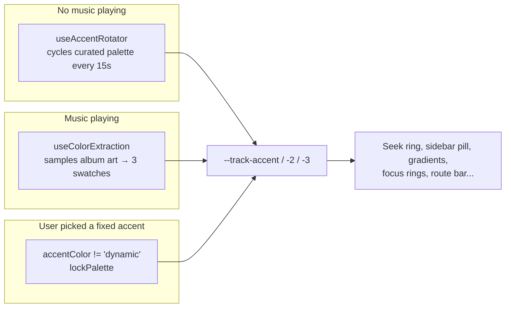

# Styling Guide

> **What you'll learn here:** how Octavia is styled — the design-token system, how theming and the dynamic accent work, how to correctly add styles to a new component, how responsive design and dark mode work, naming conventions, and the mistakes to avoid.

---

## The approach: Tailwind + CSS variables + shadcn/ui

Octavia styles components with **Tailwind CSS utility classes**, but those classes resolve to **CSS custom properties (variables)** defined in `src/index.css`. This gives the best of both worlds:
- Fast, co-located styling with Tailwind utilities (`flex p-4 text-ink`).
- A single source of truth for colors/spacing/motion via design tokens, so the whole app can re-theme by swapping variable values.

The two files that define the system:
- **`src/index.css`** — defines all design tokens (in `:root`), base typography, theme variants, and ~80 custom utility/animation classes. It's ~2,500 lines and is the heart of the visual system.
- **`tailwind.config.ts`** — maps those CSS variables into Tailwind's theme so you can write `bg-surface-2`, `text-ink-2`, `shadow-elev-3`, etc.

Plus **shadcn/ui** primitives in `src/components/ui/` (configured by `components.json`) provide accessible base components that use the same tokens.

---

## The design-token system

All tokens live in `:root` in `src/index.css`. **Colors are stored as raw HSL components** (e.g. `30 12% 4%`) so they can be used with an alpha channel like `hsl(var(--surface-0) / 0.5)`.

### Surfaces & ink (the editorial "nightside" base)

```css
--surface-0: 30 12% 4%;   /* page background, deepest ink */
--surface-1: 30 11% 6%;   /* default surface */
--surface-2: 30 10% 10%;  /* raised card */
--surface-3: 30 10% 14%;  /* tooltip / dropdown */
--surface-4: 30 9% 20%;   /* selected / hover-strong */

--ink-primary:    38 22% 96%;  /* main text (warm ivory, not pure white) */
--ink-secondary:  38 14% 78%;
--ink-tertiary:   35 10% 58%;  /* labels, hints */
--ink-quaternary: 32 8% 42%;   /* placeholders, hairlines */
```

> **Why warm, not pure black/white?** The palette is intentionally warm (hue ~30–38°) to feel like printed matter under low light — a "magazine" aesthetic rather than a tech dashboard.

In Tailwind these are `bg-surface-0..4`, `text-ink`, `text-ink-2/3/4`.

### Brand "ember" ramp
`--brand-50` … `--brand-900` (a warm orange). `--brand-500` is the default primary. Also `--oxblood` (deep red, paired with ember) and `--bone` (warm highlight). Tailwind: `bg-brand-500`, `text-oxblood`, `text-bone`, `bg-ember`.

### Dynamic per-track accent (the chameleon system)
This is the signature feature. These variables **change at runtime** based on the album art that's playing:

```css
--track-accent:           var(--brand-500);  /* primary accent */
--track-accent-strong:    var(--brand-600);
--track-accent-foreground: 30 12% 4%;
--track-accent-2: 188 78% 58%;  /* companion hue */
--track-accent-3: 268 70% 62%;  /* third hue */
```

Tailwind: `text-accent`, `bg-accent-soft`, `ring-accent`, `border-accent`, `gradient-accent`, and the `track.*` colors. They feed the seek ring, sidebar pill, route progress bar, focus rings, the page background gradient (`--gradient-main`), and more — so the whole UI subtly recolors to match the current song.

### "Gen Z play" accents
A small set of saturated counter-hues used sparingly for chips, eyebrows, and iridescent text: `--accent-2` (cyan), `--accent-lime`, `--accent-violet`, `--accent-pink`, and an iris ramp (`--accent-iris-a/b/c`). Used by `.text-iris`, `.card-magnetic`, confetti, etc. **Never on body copy.**

### shadcn compatibility layer
shadcn primitives expect semantic names, so the tokens are re-exported as `--background`, `--foreground`, `--card`, `--popover`, `--primary`, `--secondary`, `--muted`, `--accent`, `--destructive`, `--border`, `--input`, `--ring`. (`--ring` points at `--track-accent`, which is why focus rings are accent-colored.)

### Radii, spacing, chrome dimensions
```css
--radius: 0.875rem;  --radius-sharp: 0.25rem;  --radius-soft: 1.25rem;  --radius-blob: 1.75rem;
--page-max: 1600px;  --page-max-wide: 1800px;  --page-max-narrow: 1320px;
--topbar-height; --mobile-nav-height; --desktop-footer-height; ...  /* recomputed per breakpoint */
```
Chrome heights are **recomputed at every breakpoint** (from 280px smartwatches to 7680px 8K displays) so the layout's bottom-padding math always reserves the right space for the footer/nav.

### Motion & elevation tokens
```css
--ease-emphasis / --ease-decel / --ease-accel / --ease-spring / --ease-bounce
--dur-instant: 80ms; --dur-short: 140ms; --dur-med: 220ms; --dur-long: 380ms; --dur-xlong: 600ms;
--shadow-1 … --shadow-5; --shadow-accent; --rim-1/2; --elev-card; --gradient-main; --hairline;
```
Tailwind exposes these as `ease-emphasis`, `duration-med`, `shadow-elev-3`, `shadow-accent`.

---

## How theming works

> **Important:** Tailwind's config has `darkMode: ["class"]`, but Octavia does **not** use a `.dark` class for its themes. Instead it sets a **`data-theme` attribute on `<html>`**. There are 8 themes:

| `data-theme` value | Look |
|--------------------|------|
| *(absent / `dark`)* | Default warm "editorial nightside" dark |
| `oled` | Pure black (great for OLED screens) |
| `light` | Warm cream "editorial day" |
| `hicontrast` | AAA-style high contrast |
| `midnight` | Cool indigo dark |
| `sepia` | Parchment reading mode |
| `forest` | Evergreen dark |
| `slate` | Cool Nordic gray |

Each theme block in `index.css` (e.g. `:root[data-theme='midnight'] { ... }`) overrides the surface/ink/brand tokens. **Components don't know which theme is active** — they just use `bg-surface-2` etc., and the tokens change underneath. That's the whole point of the token system.

**Who sets `data-theme`?** `src/components/common/SettingsEffects.jsx` reads `settings.theme` and applies it to `<html>`, plus `data-reduce-motion`, `data-text-size`, and the accent palette lock. To avoid a flash of the wrong theme on first paint, `main.jsx` reads `localStorage` (`octavia.appearance.v1`) and applies the theme **before React mounts**.

---

## The accent pipeline (three mechanisms)

The dynamic `--track-accent*` variables are driven by three cooperating systems:



1. **Idle rotation** — `useAccentRotator` (`src/hooks/use-accent-rotator.js`), mounted in `App.jsx`, lerps through a curated HSL palette every 15s when nothing overrides it (pauses when the tab is hidden).
2. **Playing extraction** — `useColorExtraction` (`src/hooks/use-color-extraction.js`), used in `FooterPlayer`, samples the album art and RAF-lerps three coordinated swatches onto the accent variables so the page recolors smoothly per song.
3. **Pinned preset** — if the user sets `accentColor` to something other than `dynamic` in Settings, `lockPalette` (from `accent-presets.js`) freezes the accent.

Because everything reads from CSS variables, the transition is automatic — no per-component animation code.

---

## How to add styles to a new component (the right way)

1. **Use Tailwind utilities backed by tokens** — prefer semantic tokens over raw values:
   - ✅ `className="bg-surface-2 text-ink-2 rounded-lg shadow-elev-2"`
   - ❌ `className="bg-[#1a1815] text-[#c8c0b4] rounded-[14px]"` (hardcoded; ignores theming)
2. **Compose classes with `cn()`** from `@/lib/utils` (it merges Tailwind classes and resolves conflicts):
   ```jsx
   import { cn } from '@/lib/utils';
   <div className={cn('row-hover px-4 py-2', isActive && 'bg-accent-soft', className)} />
   ```
3. **Reach for the editorial utility classes** in `index.css` instead of re-inventing patterns:
   - `.card-premium` — the canonical raised card (rim-light + shadow).
   - `.glass` / `.glass-strong` — frosted surfaces.
   - `.row-hover` — the standard list-row hover tint.
   - `.lift` / `.press` — hover-lift / press-scale micro-interactions.
   - `.eyebrow` — the small-caps mono label above headlines.
   - `.page-shell` / `.page-shell-wide` / `.page-shell-narrow` — page horizontal rhythm + max width.
   - `.tabular` — tabular numerals for times/counts.
   - `.focus-premium` / `.focus-ring` — the accent focus ring (for buttons/inputs the global ring skips).
4. **Prefer a `ui-v2/` component** if one exists (`Button`, `Input`, `EmptyState`, `SectionHeader`, `Skeleton`, `Surface`, `Kbd`, `KindBadge`, `Stat`) before hand-rolling.
5. **Respect motion preferences** — if you add an animation, make sure it's covered by the reduced-motion guards (most `index.css` animations already are; custom inline animations need their own `@media (prefers-reduced-motion: reduce)` / `:root[data-reduce-motion='true']` handling).

---

## Responsive design

### Breakpoints
Defined in `tailwind.config.ts` — a dense ladder for everything from smartwatches to 8K:

| Name | Min width | | Name | Min width |
|------|-----------|---|------|-----------|
| `watch` | 280px | | `xl` | 1280px |
| `tiny` | 320px | | `hd` | 1440px |
| `xs` | 480px | | `2xl` | 1536px |
| `phablet` | 600px | | `3xl` | 1680px |
| `sm` | 640px | | `4xl` | 1920px |
| `md` | 768px | | `qhd` | 2560px |
| `lg` | 1024px | | `uhd` | 3840px |
| | | | `8k` | 7680px |

Use them as Tailwind prefixes: `class="grid-cols-2 md:grid-cols-4 xl:grid-cols-6"`.

### Layout switches
- The desktop **Sidebar** appears at `lg+`; below that you get the **MobileNav** bottom bar + **MobileDrawer**.
- Chrome-dimension tokens (`--topbar-height`, etc.) are recomputed per breakpoint so content never hides under the footer/nav. There's even a special rule for **short landscape phones** that trims chrome height.

### Touch vs pointer
`@media (hover: hover)` gates hover effects so touch devices don't get stuck hover states; touch devices get enlarged 44px targets via `.touch-target` and an `[aria-label]` min-height rule.

### Text scale
`data-text-size` (`sm`/`md`/`lg`) nudges the root `font-size` (93.75% / 100% / 109.375%), scaling the whole rem-based UI, not just text.

---

## Typography

- **One typeface family:** Roboto (UI/body) + Roboto Mono (numerals/data). Two display accents — DM Serif Display and Syne Mono — are used only on now-playing "vintage" surfaces. All loaded in `index.html`.
- `font-synthesis: none` forbids fake bold/italic — only real font cuts are used.
- Helper classes: `.font-display`, `.font-display-tight`, `.font-headline`, `.font-editorial`, `.font-mono`, `.font-vintage-display`, `.font-genz-mono`.
- Headings use fluid `clamp()` sizes; there's also a named scale in Tailwind (`text-display-2xl` … `text-display-sm`, `text-eyebrow`, `text-micro`, `text-tiny`, `text-caption`, `text-label`, `text-body`).
- Use `.tabular` for any numbers that should align (durations, ranks, counts).

---

## Performance-related styling

A subtle but important system: while the user is scrolling, `MainLayout` sets `data-scrolling="true"` on `<html>`. CSS then **temporarily disables** the grain overlay, `backdrop-filter` blur, and card hover effects during the scroll, because those force expensive main-thread re-compositing and cause jank. They re-enable ~150ms after scrolling stops. Keep this in mind if you add heavy effects — gate them similarly.

---

## Naming conventions & rules

- **Tailwind utilities first**, custom classes second, arbitrary values (`[14px]`) only as a last resort.
- **Semantic tokens, not raw colors** — `text-ink-2`, not `text-[#...]`.
- **Custom utility classes** are lowercase-kebab and described in `index.css` (e.g. `.card-premium`, `.row-hover`, `.np-ring`). The `np-` prefix means "now playing".
- **Component files** are PascalCase; **shadcn primitives** keep their generated kebab-case names.

---

## What to avoid (common mistakes)

- ❌ **Hardcoding colors/sizes** (`bg-[#1a1815]`, `text-white`) — breaks every theme. Use tokens.
- ❌ **Using `text-white`/`text-black`** — use `text-ink` / `text-ink-2`. White text is wrong on the `light`/`sepia` themes.
- ❌ **Re-inventing hover/lift/card patterns** — use `.row-hover`, `.lift`, `.card-premium`.
- ❌ **Adding animations without reduced-motion guards** — accessibility regression.
- ❌ **Assuming `.dark`** — themes are driven by `data-theme`, not a class.
- ❌ **Putting heavy `backdrop-filter`/blur on scrolling content** without respecting the `data-scrolling` guard — causes scroll jank.
- ❌ **Skipping `cn()`** when merging incoming `className` props — leads to un-overridable styles.

---

## Key things to remember

- **Tailwind classes → CSS variables.** Style with semantic tokens (`bg-surface-2`, `text-ink`) and the whole app re-themes for free.
- **Themes use `data-theme` on `<html>`** (8 of them), set by `SettingsEffects`; there's anti-flash boot code in `main.jsx`.
- **The accent is dynamic** — it follows the album art (or rotates when idle, or locks to a preset). Everything reads `--track-accent*`.
- **Use `cn()` and the editorial utility classes** (`.card-premium`, `.row-hover`, `.lift`, `.page-shell`) instead of bespoke CSS.
- **Respect reduced-motion and the scroll-jank guards.**
- Prefer **`ui-v2/`** components over hand-rolling.
