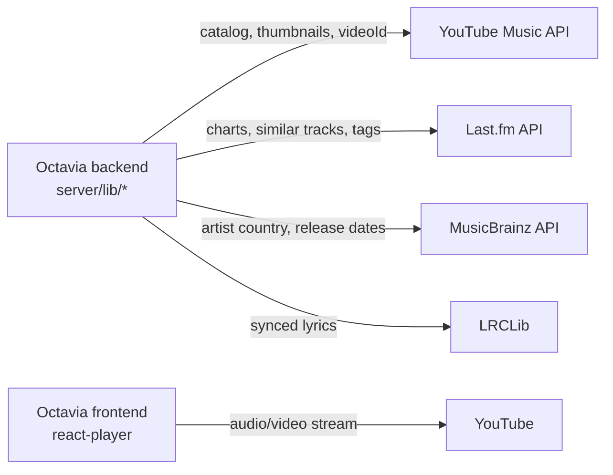

# Third-Party Services

> **What you'll learn here:** every external service Octavia depends on, what each does, exactly what Octavia uses it for, where the integration lives in the code, what credentials are needed, what breaks if it goes down, and a docs link.

---

## Overview

Octavia is a **thin aggregation layer** over free/open music data sources. It connects to **five** external services. All integrations live in `server/lib/` (the backend) except the audio stream, which the **browser** connects to directly.

| Service | Key required? | Code | What breaks if it's down |
|---------|---------------|------|--------------------------|
| YouTube Music (`ytmusic-api`) | No | `server/lib/ytmusic.js` | Most catalog data; falls back to a static catalog |
| Last.fm | **Yes** (`LASTFM_API_KEY`) | `server/lib/lastfm.js` | Real charts + "similar tracks"; charts fall back to a YTM playlist |
| MusicBrainz | No | `server/lib/musicbrainz.js` | Artist country + release-date enrichment (chart still works) |
| LRCLib | No | `server/lib/lyrics.js` | Lyrics panel (rest of app unaffected) |
| YouTube (playback) | No | `react-player` in `FooterPlayer.jsx` | **Playback itself** — the core feature |

> **Spotify is deliberately not used.** As of 2025, Spotify's Web API requires an active Premium subscription on the developer's own account, making it unavailable to free-tier developers. Last.fm + YouTube Music together cover every field Octavia renders.

---

## 1. YouTube Music — via `ytmusic-api`

**What it is:** An unofficial, in-process Node client for YouTube Music's internal API. It needs **no API key** because it mimics the YouTube Music web client.

**What Octavia uses it for (the primary catalog source):**
- Search (songs, artists, albums) — via `searchVideos`.
- Album and artist detail pages.
- Charts and trending source playlists.
- Genre samples.
- Thumbnails/cover art and, crucially, the **`videoId`** that the browser plays.
- Search autocomplete suggestions.

**Where:** `server/lib/ytmusic.js` (the client + caching), re-exported through `server/src/clients/ytmusic.client.js`. The DTO mapping is in `server/lib/mappers.js`.

**Credentials:** none. Optional tuning env vars: `YTM_CHARTS_PLAYLIST`, `YTM_TRENDING_PLAYLIST`, `YTM_CACHE_*_MIN`, `YTM_REQUEST_TIMEOUT_MS`, `YTM_REQUEST_RETRY_COUNT`, `YTM_CACHE_MAX_ENTRIES`, `YTM_WARMUP`.

**Reliability features:** an in-memory LRU cache with per-family TTLs (search 5m, detail 30m, charts/genres 60m), **request coalescing** (concurrent identical requests share one upstream call), a single client singleton initialized lazily, and **boot warmup** (the server pre-fetches charts + trending on startup).

**If it goes down / rate-limits:** search/detail/charts **fall back to the static catalog** (`server/data/catalog.js`) so the UI never blanks. A known quirk: `searchVideos` is used instead of `searchSongs` because the latter sometimes returns empty `videoId`s.

**Docs:** https://www.npmjs.com/package/ytmusic-api

---

## 2. Last.fm — charts & similarity

**What it is:** A long-running music-data web API with rankings, play/listener counts, geographic charts, tags, and similarity data.

**What Octavia uses it for:**
- The **real charts pipeline** (`/api/charts`, `/api/charts/artists`): top tracks/artists globally and by region (global, India, US, UK, Japan) and time window.
- **"Similar tracks"** for discovery (`/api/explore/similar` and the smart queue).
- Tags/genres enrichment.

**Where:** `server/lib/lastfm.js` (the client), orchestrated by `server/lib/charts-service.js` (which merges Last.fm rankings with YTM playables + MusicBrainz metadata) and `server/lib/explore-service.js`.

**Credentials:** **`LASTFM_API_KEY` is required** for charts to return real data. Get one free at https://www.last.fm/api/account/create. Optional tuning: `LASTFM_CACHE_*_MS`, `LASTFM_TIMEOUT_MS`, `LASTFM_RETRY_COUNT`.

**If it goes down / no key:** the charts endpoint **falls back to a YouTube Music playlist chart** (`meta.source: 'ytm-fallback'`) where possible; "similar tracks" falls back to a YTM search. The charts page shows a stale-data warning when serving cached/degraded data.

**Docs:** https://www.last.fm/api

---

## 3. MusicBrainz — artist & release metadata

**What it is:** An open, community-maintained music encyclopedia with a free API (no key).

**What Octavia uses it for:** enriching chart rows with **artist country/nationality** and **recording first-release dates** (the small flags/years you see on the charts page).

**Where:** `server/lib/musicbrainz.js`, called from `server/lib/charts-service.js`.

**Credentials:** none, but MusicBrainz enforces a **1 request/second** rate limit, so the client throttles itself (`MUSICBRAINZ_MIN_INTERVAL_MS = 1000`) and caches aggressively (`MUSICBRAINZ_CACHE_TTL_MS = 24h`).

**If it goes down:** charts still render — the country/date fields are simply omitted or come from cache. It's purely enrichment.

**Docs:** https://musicbrainz.org/doc/MusicBrainz_API

---

## 4. LRCLib — lyrics

**What it is:** A free, open database of song lyrics, including **time-synced** (LRC) lyrics.

**What Octavia uses it for:** the lyrics panel in the player (`/api/lyrics`). It returns synced lyrics (highlighted line-by-line as the song plays) or plain text, and flags instrumental tracks.

**Where:** `server/lib/lyrics.js`, re-exported via `server/src/clients/lyrics.client.js`; parsed on the frontend by `src/lib/lrc.js` and rendered by `LyricsPanel.jsx`.

**Credentials:** none. It sends a polite `User-Agent` (`LYRICS_CLIENT_ID`, default `Octavia (...)`). Optional tuning: `LYRICS_BASE_URL`, `LYRICS_TIMEOUT_MS`, `LYRICS_CACHE_MIN` (found = 180m), `LYRICS_CACHE_MISS_MIN` (not-found = 5m). It can also use **YouTube oEmbed** to derive a title/artist from a `videoId` when needed.

**If it goes down:** the lyrics panel shows "not available" / a retry state; the rest of the app is unaffected. The backend distinguishes a `404` (no lyrics for this song) from a `5xx` (provider down) so the UI can choose the right message.

**Docs:** https://lrclib.net/docs

---

## 5. YouTube — the audio stream (frontend, direct)

**What it is:** YouTube's standard embedded player.

**What Octavia uses it for:** **all audio playback.** This is the one integration that does **not** go through the backend.

**Where:** `react-player` (lazy-loaded) inside `src/components/layout/FooterPlayer.jsx`. The backend only provides the `videoId`; the browser streams the media directly from YouTube.

**Credentials:** none (it's a public embed).

**If it goes down:** **playback stops** — this is the most critical dependency, because audio *is* the product. Metadata browsing would still work, but nothing would play.

**Docs:** https://github.com/cookpete/react-player (and YouTube's iframe player under the hood).

> Because the audio comes from a YouTube iframe (not a Web Audio source Octavia controls), the player's visualizer is **deterministic/fake** — it can't analyze the real audio. See [known-issues.md](./known-issues.md).

---

## Google Fonts (asset dependency)

Not a data API, but worth noting: `index.html` loads four fonts (Roboto, Roboto Mono, DM Serif Display, Syne Mono) from Google Fonts, with `preconnect` hints. If Google Fonts is unreachable, the app falls back to system fonts (`font-display: swap`), so text stays readable.

---

## Credentials checklist

| Variable | Service | Required for |
|----------|---------|--------------|
| `LASTFM_API_KEY` | Last.fm | Real charts + similar tracks |
| *(none)* | YouTube Music | Catalog, playback |
| *(none)* | MusicBrainz | Chart enrichment |
| *(none)* | LRCLib | Lyrics |

**The only external credential you need is `LASTFM_API_KEY`.** See [environment-variables.md](./environment-variables.md).

---

## Key things to remember

- **Octavia aggregates free sources** — only Last.fm needs a key.
- **YouTube Music is the catalog backbone**; failures fall back to a static catalog so the UI never blanks.
- **The backend never touches audio.** The browser streams it directly from YouTube via `react-player` — the single most critical dependency.
- **MusicBrainz and LRCLib are graceful enhancements** — if they fail, charts and the app still work, just with less metadata / no lyrics.
- **Spotify is intentionally avoided** due to its Premium-only API requirement.
